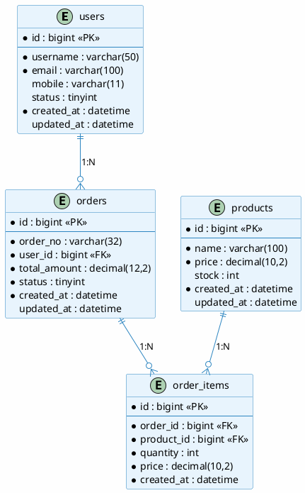

# ER 图绘制指南

## 概述

ER 图（Entity-Relationship Diagram）是数据库设计的重要工具，用于可视化实体之间的关系。本文详解 ER 图的概念、符号规范及绘制方法。

## ER 图基本概念

### 什么是 ER 图

ER 图用于描述现实世界中实体及其相互关系，是数据库概念设计的核心产出物。

```
┌──────────────┐          ┌──────────────────┐          ┌──────────────┐
│    用户      │          │       订单       │          │     商品     │
├──────────────┤          ├──────────────────┤          ├──────────────┤
│ PK  user_id  │──┐  1:N ┌│ PK  order_id     │      N:M │ PK  product_id│
│    username  │  └──────│ FK  user_id      │──┐   ┌───│    name      │
│    email      │         │    total_amount  │  │   │   │    price     │
│    mobile     │         │    status        │  │   │   │    stock     │
└──────────────┘         │    created_at    │  │   │   └──────────────┘
                          └──────────────────┘  │   │
                                              ┌─┘   └─┐
                                     ┌──────────────────┐
                                     │   订单明细       │
                                     ├──────────────────┤
                                     │ PK  item_id     │
                                     │ FK  order_id    │
                                     │ FK  product_id  │
                                     │    quantity     │
                                     │    price        │
                                     └──────────────────┘
```

### 核心组件

| 组件 | 符号 | 说明 |
|------|------|------|
| 实体（Entity） | 矩形 | 代表一个对象，如用户、订单 |
| 属性（Attribute） | 椭圆 | 实体的特征，如用户名、邮箱 |
| 主键（Primary Key） | 下划线 | 唯一标识实体的属性 |
| 关系（Relationship） | 菱形 | 实体之间的联系 |
| 外键（Foreign Key） | - | 引用其他实体的属性 |

## 符号规范

### 实体符号

```markdown
┌─────────────────┐
│    实体名称     │    ← 矩形，三实线边框（部分工具）
└─────────────────┘

# 实体命名规范
- 使用英文单词或通用缩写
- 单数名词
- PascalCase 或 snake_case
- 示例：User, OrderItem, ProductCategory
```

### 属性符号

```markdown
# 普通属性
    ┌────────────┐
────│   属性名    │────
    └────────────┘

# 主键属性（带下划线）
    ┌────────────┐
────│ __属性名__ │────
    └────────────┘

# 多值属性（双椭圆）
    ⎛────────────⎞
───│   属性名    │───
    ⎝────────────⎝
```

### 关系符号

```markdown
# 一对一关系 (1:1)
    ┌───┐       ┌───┐
    │ A │───────│ B │
    └───┘       └───┘

# 一对多关系 (1:N)
    ┌───┐       ┌───┐
    │ A │───┬───│ B │
    └───┘   │   └───┘
            │
           N

# 多对多关系 (N:M)
    ┌───┐       ┌───┐
    │ A │───┬───│ B │
    └───┘   │   └───┘
            │
           M
```

### 完整 ER 图示例

```
┌────────────────────────────────────────────────────────────────────────┐
│                         ER 图符号规范                                   │
├────────────────────────────────────────────────────────────────────────┤
│                                                                         │
│  实体          属性            关系             基数                     │
│  ┌───┐        ○ 属性名         ◇ 关系名      1      唯一               │
│  │   │       ╱│╲                            N      多个                │
│  │实体│──────attributes                          M      多对多         │
│  │   │      └─┴─                              N:M    多对多          │
│  └───┘                                          1:N    一对多         │
│                                                  1:1    一对一         │
│  主键                                                       │
│  ┌───┐     外键                                            │
│  │用户│─────user_id────>                                    │
│  │_id_│                                                        │
│  └───┘                                                        │
│                                                                         │
└────────────────────────────────────────────────────────────────────────┘
```

## 关系类型详解

### 一对一关系 (1:1)

```sql
-- 示例：用户和用户详情
-- 表设计：
-- users (id, username, email)
-- user_profiles (user_id, birthday, gender, avatar)

-- 关系说明：一个用户对应一个详情
CREATE TABLE users (
    id BIGINT PRIMARY KEY,
    username VARCHAR(50) NOT NULL
);

CREATE TABLE user_profiles (
    user_id BIGINT PRIMARY KEY,  -- 同时也是外键
    birthday DATE,
    gender CHAR(1),
    CONSTRAINT fk_profile_user FOREIGN KEY (user_id) REFERENCES users(id)
);
```

### 一对多关系 (1:N)

```sql
-- 示例：用户和订单
-- 表设计：
-- users (id, username)
-- orders (id, user_id, order_no)

-- 关系说明：一个用户有多个订单
CREATE TABLE users (
    id BIGINT PRIMARY KEY,
    username VARCHAR(50) NOT NULL
);

CREATE TABLE orders (
    id BIGINT PRIMARY KEY,
    user_id BIGINT NOT NULL,  -- 外键指向 users
    order_no VARCHAR(32) NOT NULL,
    CONSTRAINT fk_order_user FOREIGN KEY (user_id) REFERENCES users(id)
);
```

### 多对多关系 (N:M)

```sql
-- 示例：学生和课程
-- 需要中间表
-- students (id, name)
-- courses (id, name)
-- student_courses (student_id, course_id)

CREATE TABLE students (
    id BIGINT PRIMARY KEY,
    name VARCHAR(50) NOT NULL
);

CREATE TABLE courses (
    id BIGINT PRIMARY KEY,
    name VARCHAR(50) NOT NULL
);

CREATE TABLE student_courses (
    student_id BIGINT NOT NULL,
    course_id BIGINT NOT NULL,
    PRIMARY KEY (student_id, course_id),
    CONSTRAINT fk_sc_student FOREIGN KEY (student_id) REFERENCES students(id),
    CONSTRAINT fk_sc_course FOREIGN KEY (course_id) REFERENCES courses(id)
);
```

## 绘制工具

### 在线工具

| 工具 | 特点 | 适用场景 |
|------|------|----------|
| draw.io | 免费、在线、导出方便 | 快速绘制、团队协作 |
| dbdiagram.io | 专用于数据库 | 代码生成 SQL |
| PlantUML | 文本描述 | CI/CD 集成 |
| Mermaid | Markdown 内嵌 | 文档嵌入 |
| Lucidchart | 功能强大 | 企业级协作 |

### 桌面工具

| 工具 | 特点 | 适用场景 |
|------|------|----------|
| Navicat Data Modeler | 免费、MySQL 友好 | MySQL 设计 |
| PowerDesigner | 功能全面 | 企业级设计 |
| Enterprise Architect | UML 全家桶 | 完整建模 |

## draw.io 使用指南

### 基本操作

```
1. 打开 https://app.diagrams.net/
2. 选择「新建图表」
3. 从左侧组件库拖拽形状
4. 添加实体框（矩形）
5. 添加属性（椭圆，拖到实体框内）
6. 添加关系线
```

### 绘制步骤

```markdown
# 步骤 1: 添加实体
- 拖拽「矩形」到画布
- 双击输入实体名称
- 格式：实线边框，填充浅灰色

# 步骤 2: 添加属性
- 拖拽「椭圆」到实体框内
- 主键：下划线属性名
- 普通属性：属性名
- 外键：斜体或不同颜色

# 步骤 3: 添加关系
- 拖拽「线」连接实体
- 标注关系类型（1:1, 1:N, N:M）
- 标注关系名称（可选）

# 步骤 4: 完善样式
- 实体框：浅蓝色填充
- 主键：加粗
- 外键：斜体
- 关系线：加箭头
```

### 导出格式

```
导出方式：
- PNG: 图片格式，适合文档
- SVG: 矢量图，可无损缩放
- XML: draw.io 格式，保留可编辑性
- PDF: 打印格式
```

## dbdiagram.io 使用指南

### 代码示例

```sql
// 定义表结构，使用简洁的 DSL
// 参考: https://dbdiagram.io/

// 用户模块
Table users {
  id bigint [pk, increment]
  username varchar(50) [not null]
  email varchar(100) [unique]
  mobile varchar(11)
  status tinyint [default: 0]
  created_at datetime [default: 'now()']
  updated_at datetime
  deleted_at datetime
}

// 订单表
Table orders {
  id bigint [pk, increment]
  order_no varchar(32) [not null, unique]
  user_id bigint [not null, ref: > users.id]
  total_amount decimal(12,2) [not null, default: 0]
  status tinyint [not null, default: 0]
  created_at datetime [default: 'now()']
  updated_at datetime
  deleted_at datetime
}

// 订单明细表
Table order_items {
  id bigint [pk, increment]
  order_id bigint [not null, ref: > orders.id]
  product_id bigint [not null, ref: > products.id]
  quantity int [not null, default: 1]
  price decimal(10,2) [not null]
  created_at datetime [default: 'now()']
}

// 商品表
Table products {
  id bigint [pk, increment]
  name varchar(100) [not null]
  price decimal(10,2) [not null]
  stock int [default: 0]
  created_at datetime [default: 'now()']
  updated_at datetime
  deleted_at datetime
}

// 索引定义
Table orders {
  indexes {
    (user_id, status) [name: 'idx_user_status']
    (created_at) [name: 'idx_created']
  }
}

// 关系说明
// users 1:N orders (一个用户有多个订单)
// orders 1:N order_items (一个订单有多个明细)
// products 1:N order_items (一个商品可在多个订单中出现)
```

### 生成 SQL

```bash
# 在 dbdiagram.io 页面
# 点击「Export」-> 「PostgreSQL/MySQL」
# 自动生成建表 SQL

-- 生成结果示例
CREATE TABLE users (
    id BIGINT AUTO_INCREMENT PRIMARY KEY,
    username VARCHAR(50) NOT NULL,
    email VARCHAR(100) UNIQUE,
    mobile VARCHAR(11),
    status TINYINT DEFAULT 0,
    created_at DATETIME DEFAULT CURRENT_TIMESTAMP,
    updated_at DATETIME,
    deleted_at DATETIME
);
```

## PlantUML 使用指南

### 数据库 ER 图



### Mermaid 语法

```markdown
erDiagram
    USERS ||--o{ ORDERS : "1:N"
    ORDERS ||--o{ ORDER_ITEMS : "1:N"
    PRODUCTS ||--o{ ORDER_ITEMS : "1:N"

    USERS {
        bigint id PK
        varchar username
        varchar email
        varchar mobile
        tinyint status
        datetime created_at
    }

    ORDERS {
        bigint id PK
        varchar order_no
        bigint user_id FK
        decimal total_amount
        tinyint status
        datetime created_at
    }

    ORDER_ITEMS {
        bigint id PK
        bigint order_id FK
        bigint product_id FK
        int quantity
        decimal price
    }

    PRODUCTS {
        bigint id PK
        varchar name
        decimal price
        int stock
    }
```

## 实际项目 ER 图示例

### 电商系统 ER 图

```sql
-- ============================================
-- 电商系统数据库设计
-- ============================================

-- 用户模块
CREATE TABLE sys_user (
    id BIGINT UNSIGNED NOT NULL AUTO_INCREMENT COMMENT '用户ID',
    username VARCHAR(50) NOT NULL COMMENT '用户名',
    password VARCHAR(128) NOT NULL COMMENT '密码',
    nickname VARCHAR(50) COMMENT '昵称',
    email VARCHAR(100) COMMENT '邮箱',
    mobile VARCHAR(11) COMMENT '手机号',
    avatar VARCHAR(255) COMMENT '头像URL',
    status TINYINT NOT NULL DEFAULT 1 COMMENT '状态：0-禁用 1-正常',
    last_login_at DATETIME COMMENT '最后登录时间',
    last_login_ip VARCHAR(45) COMMENT '最后登录IP',
    created_at DATETIME NOT NULL DEFAULT CURRENT_TIMESTAMP COMMENT '创建时间',
    updated_at DATETIME NOT NULL DEFAULT CURRENT_TIMESTAMP ON UPDATE CURRENT_TIMESTAMP COMMENT '更新时间',
    deleted_at DATETIME COMMENT '删除时间',
    PRIMARY KEY (id),
    UNIQUE KEY uk_username (username),
    UNIQUE KEY uk_email (email),
    UNIQUE KEY uk_mobile (mobile),
    INDEX idx_status (status)
) ENGINE=InnoDB DEFAULT CHARSET=utf8mb4 COMMENT='用户表';

-- 地址模块
CREATE TABLE sys_address (
    id BIGINT UNSIGNED NOT NULL AUTO_INCREMENT COMMENT '地址ID',
    user_id BIGINT UNSIGNED NOT NULL COMMENT '用户ID',
    receiver_name VARCHAR(50) NOT NULL COMMENT '收货人姓名',
    receiver_mobile VARCHAR(11) NOT NULL COMMENT '收货人手机',
    province VARCHAR(50) NOT NULL COMMENT '省份',
    city VARCHAR(50) NOT NULL COMMENT '城市',
    district VARCHAR(50) NOT NULL COMMENT '区县',
    detail_address VARCHAR(255) NOT NULL COMMENT '详细地址',
    postal_code VARCHAR(10) COMMENT '邮政编码',
    is_default TINYINT NOT NULL DEFAULT 0 COMMENT '是否默认：0-否 1-是',
    created_at DATETIME NOT NULL DEFAULT CURRENT_TIMESTAMP COMMENT '创建时间',
    updated_at DATETIME NOT NULL DEFAULT CURRENT_TIMESTAMP ON UPDATE CURRENT_TIMESTAMP COMMENT '更新时间',
    PRIMARY KEY (id),
    INDEX idx_user_id (user_id),
    CONSTRAINT fk_address_user FOREIGN KEY (user_id) REFERENCES sys_user(id)
) ENGINE=InnoDB DEFAULT CHARSET=utf8mb4 COMMENT='收货地址表';

-- 商品分类
CREATE TABLE bas_category (
    id BIGINT UNSIGNED NOT NULL AUTO_INCREMENT COMMENT '分类ID',
    parent_id BIGINT UNSIGNED DEFAULT 0 COMMENT '父分类ID',
    name VARCHAR(50) NOT NULL COMMENT '分类名称',
    icon VARCHAR(255) COMMENT '分类图标',
    sort_order INT NOT NULL DEFAULT 0 COMMENT '排序',
    status TINYINT NOT NULL DEFAULT 1 COMMENT '状态：0-禁用 1-启用',
    created_at DATETIME NOT NULL DEFAULT CURRENT_TIMESTAMP COMMENT '创建时间',
    updated_at DATETIME NOT NULL DEFAULT CURRENT_TIMESTAMP ON UPDATE CURRENT_TIMESTAMP COMMENT '更新时间',
    PRIMARY KEY (id),
    INDEX idx_parent_id (parent_id),
    INDEX idx_sort_order (sort_order)
) ENGINE=InnoDB DEFAULT CHARSET=utf8mb4 COMMENT='商品分类表';

-- 商品表
CREATE TABLE bas_product (
    id BIGINT UNSIGNED NOT NULL AUTO_INCREMENT COMMENT '商品ID',
    category_id BIGINT UNSIGNED NOT NULL COMMENT '分类ID',
    name VARCHAR(200) NOT NULL COMMENT '商品名称',
    subtitle VARCHAR(500) COMMENT '副标题',
    price DECIMAL(10,2) NOT NULL COMMENT '售价',
    cost_price DECIMAL(10,2) COMMENT '成本价',
    original_price DECIMAL(10,2) COMMENT '原价',
    stock INT NOT NULL DEFAULT 0 COMMENT '库存',
    sold_count INT NOT NULL DEFAULT 0 COMMENT '销量',
    main_image VARCHAR(500) COMMENT '主图',
    images TEXT COMMENT '图片列表，JSON格式',
    description TEXT COMMENT '商品描述',
    status TINYINT NOT NULL DEFAULT 1 COMMENT '状态：0-下架 1-上架',
    created_at DATETIME NOT NULL DEFAULT CURRENT_TIMESTAMP COMMENT '创建时间',
    updated_at DATETIME NOT NULL DEFAULT CURRENT_TIMESTAMP ON UPDATE CURRENT_TIMESTAMP COMMENT '更新时间',
    deleted_at DATETIME COMMENT '删除时间',
    PRIMARY KEY (id),
    INDEX idx_category_id (category_id),
    INDEX idx_status (status),
    INDEX idx_name (name),
    INDEX idx_created (created_at),
    CONSTRAINT fk_product_category FOREIGN KEY (category_id) REFERENCES bas_category(id)
) ENGINE=InnoDB DEFAULT CHARSET=utf8mb4 COMMENT='商品表';

-- 订单表
CREATE TABLE ord_order (
    id BIGINT UNSIGNED NOT NULL AUTO_INCREMENT COMMENT '订单ID',
    order_no VARCHAR(32) NOT NULL COMMENT '订单号',
    user_id BIGINT UNSIGNED NOT NULL COMMENT '用户ID',
    address_id BIGINT UNSIGNED NOT NULL COMMENT '地址ID',
    total_amount DECIMAL(12,2) NOT NULL COMMENT '订单总额',
    discount_amount DECIMAL(12,2) NOT NULL DEFAULT 0 COMMENT '优惠金额',
    pay_amount DECIMAL(12,2) NOT NULL COMMENT '实付金额',
    freight_amount DECIMAL(10,2) NOT NULL DEFAULT 0 COMMENT '运费',
    pay_type TINYINT COMMENT '支付方式：1-微信 2-支付宝',
    pay_time DATETIME COMMENT '支付时间',
    status TINYINT NOT NULL DEFAULT 0 COMMENT '状态：0-待付款 1-待发货 2-待收货 3-已完成 4-已取消 5-已退款',
    remark VARCHAR(500) COMMENT '备注',
    created_at DATETIME NOT NULL DEFAULT CURRENT_TIMESTAMP COMMENT '创建时间',
    updated_at DATETIME NOT NULL DEFAULT CURRENT_TIMESTAMP ON UPDATE CURRENT_TIMESTAMP COMMENT '更新时间',
    deleted_at DATETIME COMMENT '删除时间',
    PRIMARY KEY (id),
    UNIQUE KEY uk_order_no (order_no),
    INDEX idx_user_status (user_id, status),
    INDEX idx_created (created_at),
    INDEX idx_pay_time (pay_time),
    CONSTRAINT fk_order_user FOREIGN KEY (user_id) REFERENCES sys_user(id),
    CONSTRAINT fk_order_address FOREIGN KEY (address_id) REFERENCES sys_address(id)
) ENGINE=InnoDB DEFAULT CHARSET=utf8mb4 COMMENT='订单表';

-- 订单明细表
CREATE TABLE ord_order_item (
    id BIGINT UNSIGNED NOT NULL AUTO_INCREMENT COMMENT '明细ID',
    order_id BIGINT UNSIGNED NOT NULL COMMENT '订单ID',
    product_id BIGINT UNSIGNED NOT NULL COMMENT '商品ID',
    product_name VARCHAR(200) NOT NULL COMMENT '商品名称（快照）',
    product_image VARCHAR(500) COMMENT '商品图片（快照）',
    price DECIMAL(10,2) NOT NULL COMMENT '单价（快照）',
    quantity INT NOT NULL COMMENT '数量',
    subtotal DECIMAL(12,2) NOT NULL COMMENT '小计',
    created_at DATETIME NOT NULL DEFAULT CURRENT_TIMESTAMP COMMENT '创建时间',
    PRIMARY KEY (id),
    INDEX idx_order_id (order_id),
    INDEX idx_product_id (product_id),
    CONSTRAINT fk_item_order FOREIGN KEY (order_id) REFERENCES ord_order(id),
    CONSTRAINT fk_item_product FOREIGN KEY (product_id) REFERENCES bas_product(id)
) ENGINE=InnoDB DEFAULT CHARSET=utf8mb4 COMMENT='订单明细表';
```

### ER 图可视化

```
┌─────────────────────────────────────────────────────────────────────────────┐
│                            电商系统 ER 图                                      │
├─────────────────────────────────────────────────────────────────────────────┤
│                                                                             │
│  ┌─────────────────┐                                                       │
│  │   sys_user      │  1                                                    │
│  ├─────────────────┤                                                       │
│  │ PK id           │                                                       │
│  │    username     │───┐                                                   │
│  │    email        │   │                                                   │
│  │    mobile       │   │                                                   │
│  └─────────────────┘   │                                                   │
│          │              │                                                   │
│          │ 1             │ N                                                 │
│          │        ┌─────────────────┐                                       │
│          │        │   ord_order     │                                       │
│          │        ├─────────────────┤                                       │
│          └─────── │ FK user_id      │                                       │
│                   │ PK id           │                                       │
│          ┌────────│    order_no     │                                       │
│          │        │ FK address_id   │                                       │
│          │        └─────────────────┘                                       │
│          │                │                                                  │
│          N                │                                                  │
│  ┌─────────────────┐      │ 1        ┌─────────────────┐                    │
│  │  sys_address    │      └─────────│  ord_order_item  │───────┐             │
│  ├─────────────────┤                ├─────────────────┤       │            │
│  │ PK id           │                │ PK id           │       │            │
│  │ FK user_id     │                │ FK order_id     │       │            │
│  │    receiver     │                │ FK product_id  │       │            │
│  │    mobile       │                │    product_name │       │            │
│  │    address      │                │    price        │       N            │
│  └─────────────────┘                └─────────────────┘       │            │
│                                                               │            │
│  ┌─────────────────┐                                          │            │
│  │ bas_category    │ 1                                        │            │
│  ├─────────────────┤                                          │            │
│  │ PK id           │                                          │            │
│  │    parent_id    │◄──────────────────────────┐               │            │
│  │    name         │                           │               │            │
│  │    sort_order   │                           │               │            │
│  └─────────────────┘                           │               │            │
│          │                                     │               │            │
│          │ N                                    │               │            │
│          └────────────────────────────────────►│               │            │
│                                                │               │            │
│  ┌─────────────────┐                           │ 1             │ 1          │
│  │ bas_product     │                           │               │            │
│  ├─────────────────┤                           └───────────────┘            │
│  │ PK id           │                                                   │
│  │ FK category_id  │                                                   │
│  │    name         │                                                   │
│  │    price        │                                                   │
│  │    stock        │                                                   │
│  └─────────────────┘                                                   │
│                                                                             │
│  关系说明:                                                                  │
│  - sys_user 1:N sys_address (用户可有多个收货地址)                          │
│  - sys_user 1:N ord_order (用户可有多个订单)                                │
│  - ord_order 1:N ord_order_item (订单可有多个明细)                          │
│  - bas_product 1:N ord_order_item (商品可在多个订单中出现)                   │
│  - bas_category 1:N bas_product (分类可有多个商品)                         │
│                                                                             │
└─────────────────────────────────────────────────────────────────────────────┘
```

## 绘制规范 Checklist

```markdown
# ER 图绘制检查清单

## 实体检查
- [ ] 每个实体有明确的中文注释
- [ ] 主键标识清晰
- [ ] 外键关系明确
- [ ] 必要索引已标注

## 属性检查
- [ ] 字段类型合适（不要用 VARCHAR(65535)）
- [ ] 必填字段标识 NOT NULL
- [ ] 默认值合理
- [ ] 注释完整

## 关系检查
- [ ] 基数正确（1:1, 1:N, N:M）
- [ ] 外键关系明确
- [ ] 关系有注释说明

## 规范检查
- [ ] 命名统一（英文、下划线分隔）
- [ ] 表名有前缀区分模块（sys_, ord_, bas_ 等）
- [ ] 导出为图片或 PDF
```

## 踩坑经验汇总

| 坑点 | 问题 | 解决方案 |
|------|------|----------|
| ER 图过时 | 图与实际 DB 不一致 | 同步更新，使用工具反向生成 |
| 关系画错 | N:M 漏了中间表 | 检查每条关系，都是 1:N |
| 缺少索引 | ER 图没标索引 | 补充索引设计文档 |
| 命名混乱 | 表名不统一 | 制定命名规范并严格执行 |
| 字段不全 | 只画主要字段 | 补充审计字段、状态字段 |
| 缺少说明 | 关系不清晰 | 添加关系说明注释 |

---

*本文档由 DBA 周嘉诚 创建*
*最后更新: 2026-04-29*
