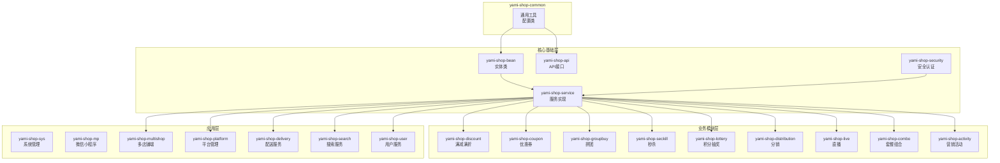

# mall4j-bbc 后端项目深度分析报告

> 分析时间: 2026-04-29
> 项目版本: SNAPSHOT
> 项目路径: /workspace/self_workspace/projects/mall4j-bbc-dev/mall4j-bbc-dev/

---

## 一、项目概述

mall4j-bbc 是一个基于 Spring Boot 的多商户 B2C 电商系统，采用微服务化模块设计，支持平台自营、商家入驻、多门店、配送、营销等多种电商业务场景。

**技术栈版本:**
- Spring Boot: 3.5.7
- Java: 17
- 数据库: MySQL 8.0 (utf8mb4)
- ORM: MyBatis-Plus 3.5.14
- 缓存: Redis (Redisson 3.52.0)
- 搜索: Elasticsearch 7.17.27
- 认证: Sa-Token 1.44.0
- 任务调度: XXL-Job 3.0.0
- 文档: Knife4j 4.5.0 / SpringDoc 2.8.13

---

## 二、架构设计

### 2.1 微服务模块拓扑图



### 2.2 模块职责清单

| 模块名称 | 职责 | 核心控制器 |
|---------|------|-----------|
| yami-shop-sys | 平台系统管理、租户管理 | SysUserController, SysRoleController, SysMenuController |
| yami-shop-api | 用户端API接口 | UserController, ProdController, OrderController, ShopCartController |
| yami-shop-common | 通用工具、配置、异常处理 | - |
| yami-shop-bean | 实体类、DTO、VO | - |
| yami-shop-security | 安全认证、权限控制 | - |
| yami-shop-service | 公共服务实现、数据访问层 | - |
| yami-shop-multishop | 多店铺端(商家后台) | ShopDetailController, ProductController, OrderController |
| yami-shop-platform | 平台管理端 | ShopAuditingController, ProductController, ShopDetailController |
| yami-shop-discount | 满减满折活动 | - |
| yami-shop-coupon | 优惠券系统 | - |
| yami-shop-groupbuy | 拼团系统 | - |
| yami-shop-seckill | 秒杀系统 | - |
| yami-shop-lottery | 积分抽奖 | - |
| yami-shop-distribution | 分销系统 | - |
| yami-shop-live | 直播系统 | - |
| yami-shop-combo | 套餐组合商品 | - |
| yami-shop-activity | 营销活动中心 | - |
| yami-shop-delivery | 配送服务(达达) | - |
| yami-shop-search | 商品搜索服务 | - |
| yami-shop-user | 用户服务 | - |
| yami-shop-mp | 微信小程序支持 | - |

---

## 三、数据库设计

### 3.1 数据库概况

- **数据库名**: yami_bbc
- **字符集**: utf8mb4
- **表数量**: 218 张
- **命名规范**: tz_ 前缀，表名使用下划线分隔

### 3.2 核心数据表清单

#### 3.2.1 用户与会员模块

| 表名 | 中文名 | 核心字段 | 关联关系 |
|------|--------|---------|---------|
| tz_user | 用户表 | user_id, nick_name, login_password, user_mobile, status, level, vip_start_time, vip_end_time, level_type | FK→tz_user_level |
| tz_user_addr | 用户地址表 | addr_id, user_id, receiver, mobile, province/city/area, addr, lng, lat | FK→tz_user |
| tz_user_level | 会员等级表 | id, level, level_name, level_type, need_growth, need_amount, discount, is_free_fee | - |
| tz_user_level_lang | 会员等级国际化 | level_lang_id, level_id, lang, level_name | FK→tz_user_level |
| tz_user_collection | 用户收藏表 | collection_id, user_id, prod_id, shop_id | FK→tz_user, FK→tz_prod |
| tz_user_balance | 用户余额表 | balance_id, user_id, balance, growth, total_growth, version | FK→tz_user |
| tz_user_score | 用户积分表 | score_id, user_id, total_score, use_score, version | FK→tz_user |
| tz_user_balance_change | 余额变动表 | change_id, user_id, change_type, change_amount, order_number | FK→tz_user |
| tz_user_score_change | 积分变动表 | score_change_id, user_id, change_type, score, order_number | FK→tz_user |
| tz_shop_customer | 店铺客户表 | shop_customer_id, user_id, shop_id, station_id, level_type, level_id | FK→tz_user, FK→tz_shop_detail |
| tz_app_connect | 第三方登录 | id, user_id, app_id, biz_user_id, biz_unionid | FK→tz_user |
| tz_score_product | 积分商品表 | score_prod_id, prod_name, score_price, stocks, sold_num | - |
| tz_metro_voucher | 地铁权益卡券 | voucher_id, user_id, voucher_name, status | FK→tz_user |

#### 3.2.2 店铺与商户模块

| 表名 | 中文名 | 核心字段 | 关联关系 |
|------|--------|---------|---------|
| tz_shop_detail | 店铺详情 | shop_id, shop_name, user_id, mobile, shop_status, type, shop_score, is_distribution | - |
| tz_shop_auditing | 店铺审核 | shop_auditing_id, user_id, shop_id, status, remarks | FK→tz_shop_detail |
| tz_shop_company | 店铺工商信息 | shop_company_id, shop_id, credit_code, firm_name, representative, legal_ids | FK→tz_shop_detail |
| tz_company_auditing | 工商审核 | company_auditing_id, shop_id, shop_company_id, status | FK→tz_shop_company |
| tz_shop_bank_card | 银行卡信息 | shop_bank_card_id, shop_id, bank_name, bank_card_no, is_default | FK→tz_shop_detail |
| tz_shop_wallet | 商家钱包 | shop_wallet_id, shop_id, unsettled_amount, settled_amount, freeze_amount, pay_sys_type | FK→tz_shop_detail |
| tz_shop_wallet_log | 钱包变动日志 | wallet_log_id, shop_id, order_number, io_type, amount_type, change_amount | FK→tz_shop_wallet |
| tz_shop_menu | 商家菜单 | menu_id, parent_id, url, perms, type, sys_type | - |
| tz_shop_role | 商家角色 | role_id, shop_id, role_name | - |
| tz_shop_employee | 商家员工 | employee_id, shop_id, user_id, type, mobile, status | FK→tz_shop_detail |
| tz_shop_employee_role | 员工角色关联 | id, employee_id, role_id | FK→tz_shop_employee, FK→tz_shop_role |
| tz_shop_template | 店铺装修模板 | template_id, shop_id, name, content, type, page_type | FK→tz_shop_detail |
| tz_shop_growth_config | 成长值配置 | id, shop_id, growth_gain, growth_question | FK→tz_shop_detail |

#### 3.2.3 商品与分类模块

| 表名 | 中文名 | 核心字段 | 关联关系 |
|------|--------|---------|---------|
| tz_prod | 商品主表 | prod_id, prod_name, shop_id, ori_price, price, pic, status, category_id, brand_id, delivery_template_id, prod_type, activity_id, pre_sell_status | FK→tz_shop_detail, FK→tz_category |
| tz_sku | 单品SKU表 | sku_id, prod_id, properties, price, ori_price, stock, weight, volume | FK→tz_prod |
| tz_category | 商品分类表 | category_id, parent_id, category_name, pic, seq, status | 自关联 |
| tz_category_lang | 分类国际化 | category_id, lang, category_name | FK→tz_category |
| tz_category_brand | 分类品牌关联 | id, category_id, brand_id | FK→tz_category, FK→tz_brand |
| tz_category_prop | 分类属性关联 | id, category_id, prop_id | FK→tz_category |
| tz_category_shop | 店铺分类 | category_id, shop_id, parent_id, category_name | FK→tz_shop_detail |
| tz_brand | 品牌表 | brand_id, brand_name, img_url, first_letter | - |
| tz_prod_tag | 商品标签 | tag_id, tag_name, prod_id | FK→tz_prod |
| tz_prod_collocation | 商品搭配 | collocation_id, prod_id, collocation_prods | FK→tz_prod |
| tz_prod_parameter | 商品参数 | parameter_id, prod_id, prop_name, spec_name | FK→tz_prod |
| tz_prod_browse_log | 浏览记录 | browse_id, user_id, prod_id, browse_time | FK→tz_user, FK→tz_prod |

#### 3.2.4 订单与交易模块

| 表名 | 中文名 | 核心字段 | 关联关系 |
|------|--------|---------|---------|
| tz_order | 订单主表 | order_id, shop_id, station_id, order_number, user_id, total, actual_total, status, pay_type, dvy_type, freight_amount, reduce_amount, platform_amount, shop_coupon_amount, member_amount, discount_amount, distribution_amount, score, is_settled, order_type, order_mold, write_off_status | FK→tz_shop_detail, FK→tz_user |
| tz_order_item | 订单项表 | order_item_id, order_number, prod_id, sku_id, prod_count, price, prod_name, sku_name, pic | FK→tz_order, FK→tz_prod, FK→tz_sku |
| tz_order_addr | 订单地址表 | addr_id, user_id, order_id, receiver, mobile, province/city/area, addr, lng, lat | FK→tz_order, FK→tz_user_addr |
| tz_order_item_changlog | 订单项价格变动日志 | id, order_item_id, change_amount | FK→tz_order_item |
| tz_order_change_amount | 订单改价记录 | id, order_id, change_amount, before_total, after_total, reason | FK→tz_order |
| tz_order_invoice | 订单发票 | invoice_id, order_number, invoice_type, invoice_title, tax_no | FK→tz_order |
| tz_order_pay | 支付记录表 | pay_id, order_number, pay_type, pay_amount, pay_time, pay_status, transaction_id, pay_sys_type | FK→tz_order |
| tz_allot_order | 调拨单 | allot_order_id, allot_number, shop_id, station_id, from_station_id, to_station_id, status | FK→tz_station |
| tz_allot_order_item | 调拨单明细 | id, allot_order_id, prod_id, sku_id, allot_count | FK→tz_allot_order |
| tz_order_on_behalf | 代客下单 | behalf_id, order_id, employee_id, status | FK→tz_order |

#### 3.2.5 物流与配送模块

| 表名 | 中文名 | 核心字段 | 关联关系 |
|------|--------|---------|---------|
| tz_delivery | 配送方式表 | dvy_id, dvy_name, dvy_type, is_default, first_weight, first_fee, add_weight, add_fee | - |
| tz_transport | 运费模板 | transport_id, shop_id, transport_name, is_default, transport_type | FK→tz_shop_detail |
| tz_transfee | 运费项 | transfee_id, transport_id, first_piece, first_fee, continuous_piece, continuous_fee | FK→tz_transport |
| tz_transfee_free | 指定条件包邮 | transfee_free_id, transport_id, free_type, amount, piece | FK→tz_transport |
| tz_transfee_city | 地区运费 | id, transport_id, city_id, city_name, first_fee, continuous_fee | FK→tz_transport |
| tz_station | 自提点/门店 | station_id, shop_id, station_name, phone, status, province/city/area, lng, lat, stock_mode, delivery_type, dada_business_id | FK→tz_shop_detail |
| tz_station_delivery_area | 门店配送范围 | id, station_id, area_id, area_name | FK→tz_station |
| tz_order_delivery | 订单配送信息 | id, order_number, dvy_id, dvy_flow_id, status | FK→tz_order |
| tz_dada_business | 达达配送品类 | id, dada_business_id, lang, dada_business_name | - |
| tz_dada_order | 达达订单 | id, order_number, dada_order_id, status, reason | FK→tz_order |

#### 3.2.6 营销活动模块

| 表名 | 中文名 | 核心字段 | 关联关系 |
|------|--------|---------|---------|
| tz_coupon | 优惠券表 | coupon_id, shop_id, coupon_name, coupon_type, cash_condition, reduce_amount, coupon_discount, valid_time_type, stocks, limit_num, suitable_prod_type, puton_status, get_way, is_score_type, score_price | FK→tz_shop_detail |
| tz_coupon_prod | 优惠券商品关联 | id, coupon_id, prod_id | FK→tz_coupon |
| tz_coupon_user | 用户优惠券 | coupon_user_id, user_id, coupon_id, status, get_time, used_time | FK→tz_user, FK→tz_coupon |
| tz_coupon_station | 优惠券适用门店 | id, coupon_id, station_id | FK→tz_coupon, FK→tz_station |
| tz_discount | 满减满折活动 | discount_id, shop_id, discount_name, discount_rule, discount_type, suitable_prod_type, max_reduce_amount, start_time, end_time, status | FK→tz_shop_detail |
| tz_discount_item | 满减满折明细 | id, discount_id,满x, discount_amount, discount_rate | FK→tz_discount |
| tz_discount_station | 满减适用门店 | id, discount_id, station_id | FK→tz_discount, FK→tz_station |
| tz_seckill | 秒杀活动 | seckill_id, seckill_name, start_time, end_time, shop_id, prod_id, seckill_price, seckill_total_stocks, status | FK→tz_shop_detail, FK→tz_prod |
| tz_seckill_sku | 秒杀SKU | seckill_sku_id, sku_id, seckill_id, seckill_price, seckill_stocks | FK→tz_seckill, FK→tz_sku |
| tz_group_activity | 拼团活动 | group_activity_id, shop_id, activity_name, prod_id, start_time, end_time, group_valid_time, group_number, status, price | FK→tz_shop_detail, FK→tz_prod |
| tz_group_order | 拼团订单 | group_order_id, shop_id, group_team_id, group_activity_id, order_number, status | FK→tz_group_activity, FK→tz_order |
| tz_group_team | 拼团团队 | group_team_id, group_activity_id, group_number, group_number | FK→tz_group_activity |
| tz_lottery | 积分抽奖 | lottery_id, activity_name, consumption, frequency_type, frequency, number_wins, start_time, end_time, status | - |
| tz_lottery_prize | 抽奖奖品 | lottery_prize_id, lottery_id, prize_name, prize_mold, prize_number, score_number | FK→tz_lottery |
| tz_lottery_record | 抽奖记录 | lottery_record_id, lottery_id, user_id, lottery_prize_id, create_time | FK→tz_lottery, FK→tz_user |
| tz_lottery_user | 用户抽奖资格 | id, lottery_id, user_id, draw_count, update_time | FK→tz_lottery, FK→tz_user |
| tz_activity | 营销活动主表 | activity_id, activity_name, start_time, end_time, status, activity_type | - |

#### 3.2.7 分销模块

| 表名 | 中文名 | 核心字段 | 关联关系 |
|------|--------|---------|---------|
| tz_distribution_user | 分销员表 | distribution_user_id, user_id, shop_id, parent_user_id, state, total_amount, frozen_amount | FK→tz_user |
| tz_distribution_auditing | 分销员申请审核 | auditing_id, distribution_user_id, parent_distribution_user_id, state, remarks | FK→tz_distribution_user |
| tz_distribution_prod | 分销商品 | distribution_prod_id, shop_id, prod_id, state, award_proportion, award_numbers | FK→tz_shop_detail, FK→tz_prod |
| tz_distribution_prod_bind | 分销商品用户绑定 | id, distribution_user_id, user_id, prod_id, state | FK→tz_distribution_user |
| tz_distribution_prod_log | 分销商品记录 | id, distribution_prod_id, user_id, order_number, change_amount, type | FK→tz_distribution_prod |
| tz_distribution_order | 分销订单 | distribution_order_id, order_id, distribution_user_id, user_id, level, amount, status | FK→tz_order |
| tz_distribution_order_rec | 分销订单记录 | id, distribution_order_id, amount, status, settle_time | FK→tz_distribution_order |
| tz_distribution_grade | 分销等级 | grade_id, grade_name, shop_id, lower_num, self_amount, lower_amount, reward_proportion | FK→tz_shop_detail |
| tz_distribution_msg | 分销公告 | msg_id, shop_id, level, msg_title, content, state | FK→tz_shop_detail |

#### 3.2.8 退款与售后模块

| 表名 | 中文名 | 核心字段 | 关联关系 |
|------|--------|---------|---------|
| tz_order_refund | 退款订单表 | refund_id, refund_sn, order_number, refund_type, refund_status, refund_amount, user_id, reason, remark, shop_id | FK→tz_order |
| tz_order_refund_addr | 退款退货地址 | refund_addr_id, shop_id, receiver, mobile, province/city/area, addr, is_default | FK→tz_shop_detail |
| tz_order_refund_image | 退款图片 | id, refund_id, img_url | FK→tz_order_refund |
| tz_refund_addr | 商家退货地址库 | refund_addr_id, shop_id, addr, receiver, mobile, is_default | FK→tz_shop_detail |

#### 3.2.9 评价与客服模块

| 表名 | 中文名 | 核心字段 | 关联关系 |
|------|--------|---------|---------|
| tz_prod_comm | 商品评价 | comm_id, prod_id, order_id, user_id, score, content, pics, reply_content, reply_time, is_hidden, shop_id | FK→tz_prod, FK→tz_order |
| tz_prod_commit_reply | 评价回复 | id, comm_id, content, reply_type, user_id, create_time | FK→tz_prod_comm |
| tz_im_channel | IM渠道 | channel_id, user_id, type, shop_id, station_id, status | FK→tz_user |
| tz_im_message | IM消息 | msg_id, channel_id, from_id, to_id, content, type, send_time | FK→tz_im_channel |
| tz_im_auto_reply | 自动回复 | id, shop_id, keyword, content, type | FK→tz_shop_detail |

#### 3.2.10 区域与配置模块

| 表名 | 中文名 | 核心字段 | 关联关系 |
|------|--------|---------|---------|
| tz_area | 省市区表 | area_id, area_name, area_name_pinyin, first_letter, parent_id, level | 自关联 |
| tz_hot_city | 热门城市 | hot_city_id, area_id, area_name, seq, status | FK→tz_area |
| tz_index_img | 首页轮播图 | img_id, shop_id, img_url, img_type, seq, status, detail | FK→tz_shop_detail |
| tz_notice | 公告表 | notice_id, shop_id, title, content, notice_type, is_top, start_time, end_time, status | FK→tz_shop_detail |
| tz_notice_tag | 公告标签 | id, notice_id, tag | FK→tz_notice |
| tz_shop_renovation | 店铺装修 | renovation_id, shop_id, name, content, home_status, renovation_type, page_type | FK→tz_shop_detail |
| tz_web_config | 网站配置 | id, config_type, is_activity, bs_logo, pc_logo, pc_company_info | - |
| tz_delivery_template | 物流公司配置 | id, dvy_name, dvy_code, logo, sort, is_default | - |

#### 3.2.11 虚拟商品与卡券模块

| 表名 | 中文名 | 核心字段 | 关联关系 |
|------|--------|---------|---------|
| tz_voucher | 卡券表 | voucher_id, voucher_name, voucher_type, price, original_price, valid_type, valid_days, stocks, sold_num, use_address | - |
| tz_voucher_user | 用户卡券 | id, user_id, voucher_id, voucher_code, status, receive_time, use_time, expire_time | FK→tz_user, FK→tz_voucher |
| tz_order_virtual_verify_log | 虚拟商品核销记录 | id, order_number, write_off_code, shop_id, station_id, handler_id, create_time | FK→tz_order |

#### 3.2.12 统计与分析模块

| 表名 | 中文名 | 核心字段 | 关联关系 |
|------|--------|---------|---------|
| tz_flow_log | 流量日志 | flow_id, shop_id, date, ip, platform, channel_id, product_id | FK→tz_shop_detail |
| tz_flow_page_analysis | 页面分析 | id, shop_id, page_url, pv, uv, avg_stay_time, access_page | FK→tz_shop_detail |
| tz_flow_user_analysis | 用户分析 | id, shop_id, date, new_user, old_user, total_user | FK→tz_shop_detail |
| tz_customer_analysis | 客户分析 | id, shop_id, date, add_customer, lost_customer, total_customer | FK→tz_shop_detail |

#### 3.2.13 其他业务表

| 表名 | 中文名 | 核心字段 | 关联关系 |
|------|--------|---------|---------|
| tz_basket | 购物车 | basket_id, shop_id, prod_id, sku_id, user_id, basket_count, discount_id, combo_id, is_checked | FK→tz_user, FK→tz_prod |
| tz_prod_collocation | 商品搭配 | collocation_id, shop_id, prod_id, collocation_prods, price, status | FK→tz_prod |
| tz_combo | 套餐表 | combo_id, shop_id, combo_name, price, stocks, sold_num, status | FK→tz_shop_detail |
| tz_combo_product | 套餐商品 | id, combo_id, prod_id, sku_id, prod_count | FK→tz_combo, FK→tz_prod |
| tz_sign | 签到表 | sign_id, user_id, shop_id, sign_date, score, continue_days | FK→tz_user |
| tz_shop_handover | 交接班记录 | id, station_id, operator_id, shift_type, create_time | FK→tz_station |
| tz_offline_handle_event | 线下收银事件 | event_id, order_id, shop_id, station_id, total_amount, status | FK→tz_shop_detail |
| tz_purchase_order | 采购订单 | purchase_order_id, purchase_number, shop_id, supplier_id, total_amount, status | FK→tz_shop_detail |
| tz_purchase_prod | 采购商品 | id, purchase_order_id, prod_id, purchase_price, purchase_count | FK→tz_purchase_order |
| tz_leaf_alloc | ID生成器 | biz_tag, max_id, step, description | - |

### 3.3 核心 ER 关系图

```mermaid
erDiagram
    tz_shop_detail ||--o{ tz_prod : "1:N"
    tz_shop_detail ||--o{ tz_order : "1:N"
    tz_shop_detail ||--o{ tz_coupon : "1:N"
    tz_shop_detail ||--o{ tz_discount : "1:N"
    tz_shop_detail ||--o{ tz_seckill : "1:N"
    tz_shop_detail ||--o{ tz_group_activity : "1:N"
    tz_shop_detail ||--o{ tz_station : "1:N"
    tz_shop_detail ||--o{ tz_shop_wallet : "1:1"
    
    tz_user ||--o{ tz_order : "1:N"
    tz_user ||--o{ tz_user_addr : "1:N"
    tz_user ||--o{ tz_basket : "1:N"
    tz_user ||--o{ tz_coupon_user : "1:N"
    tz_user ||--o{ tz_user_collection : "1:N"
    tz_user ||--|> tz_user_level : "N:1"
    
    tz_prod ||--o{ tz_sku : "1:N"
    tz_prod ||--o{ tz_prod_comm : "1:N"
    tz_prod ||--o{ tz_order_item : "1:N"
    tz_prod ||--o{ tz_basket : "1:N"
    tz_prod ||--|> tz_category : "N:1"
    tz_prod ||--|> tz_brand : "N:1"
    
    tz_category ||--o{ tz_category : "1:N"
    tz_category ||--o{ tz_prod : "1:N"
    
    tz_order ||--o{ tz_order_item : "1:N"
    tz_order ||--o| tz_order_pay : "1:1"
    tz_order ||--o{ tz_order_refund : "1:N"
    tz_order ||--o{ tz_order_addr : "1:1"
    
    tz_station ||--o{ tz_order : "1:N"
    tz_station ||--o{ tz_basket : "1:N"
    
    tz_coupon ||--o{ tz_coupon_user : "1:N"
    tz_coupon ||--o{ tz_coupon_prod : "1:N"
    
    tz_seckill ||--o{ tz_seckill_sku : "1:N"
    tz_group_activity ||--o{ tz_group_team : "1:N"
    tz_group_team ||--o{ tz_group_order : "1:N"
```

---

## 四、与 xzmeto 对比分析

### 4.1 架构设计对比

| 对比维度 | mall4j-bbc | xzmeto |
|---------|------------|--------|
| 架构模式 | 单体架构(模块化) | 微服务架构(Spring Cloud) |
| 部署方式 | 单体部署/可拆分 | 多服务独立部署 |
| 注册中心 | 无 | Alibaba Nacos |
| 网关 | 无(可集成) | Spring Cloud Gateway |
| 认证方式 | Sa-Token | Spring Security OAuth2 |
| ORM | MyBatis-Plus | MyBatis-Plus |
| 任务调度 | XXL-Job | Quartz |
| 流程引擎 | 无 | Flowable 7.0.0 |
| Java版本 | 17 | 17 |
| Spring Boot | 3.5.7 | 3.5.3 |

### 4.2 数据库设计对比

| 对比维度 | mall4j-bbc | xzmeto |
|---------|------------|--------|
| 数据库数量 | 单库 | 多库分离(pay, job, bi, mp, codegen) |
| 表命名 | tz_ 前缀 | 混合(t_, sys_, pay_, qrtz_) |
| 表数量 | 218张 | 约150张(核心) |
| 多租户 | shop_id 字段 | tenant_id 字段 |
| 主键策略 | bigint自增 | long自增 |
| 时间字段 | datetime | datetime |
| 物流支持 | 完善(自提/快递/同城配送) | 基础 |
| 营销功能 | 完整(优惠券/满减/秒杀/拼团/积分/抽奖/分销) | 无 |
| 支付功能 | 集成微信/支付宝/通联 | 独立支付平台 |

### 4.3 业务功能对比

| 业务模块 | mall4j-bbc | xzmeto |
|---------|------------|--------|
| 用户管理 | 会员体系、积分、余额、成长值 | 租户用户、角色权限 |
| 商品管理 | SKU、商品分类、品牌、规格参数 | 资源管理(楼栋/单元/楼层/房间) |
| 订单管理 | 完整订单流程、拆单、代客下单 | 合同关联的业务订单 |
| 营销功能 | 优惠券、满减满折、秒杀、拼团、积分商城、抽奖、分销 | 无 |
| 店铺管理 | 多店铺入驻、门店管理、配送范围 | 租户管理 |
| 物流配送 | 多种配送方式(快递/自提/同城配送)、达达集成 | 无 |
| 评价系统 | 商品评价、追评、评价回复 | 无 |
| 直播电商 | 直播功能集成 | 无 |
| 数据统计 | 流量分析、客户分析、销售统计 | BI报表平台 |

### 4.4 优劣分析

#### mall4j-bbc 优势
1. **电商功能完善**: 开箱即用的B2C电商系统，营销功能全面
2. **多门店支持**: 支持品牌+门店两级架构
3. **多种配送方式**: 快递、自提、同城配送一体化
4. **会员体系**: 积分、余额、成长值、会员等级完整
5. **代码结构清晰**: 模块化设计，职责清晰
6. **国际化支持**: 分类、菜单等支持中英文

#### mall4j-bbc 劣势
1. **单体架构**: 不利于大规模部署和扩展
2. **缺少服务治理**: 无熔断、限流、网关等微服务组件
3. **数据库单库**: 高并发场景扩展性受限
4. **缺少流程引擎**: 无法支持复杂审批流程

#### xzmeto 优势
1. **微服务架构**: 便于水平扩展和服务治理
2. **多数据库分离**: 不同业务域独立数据库
3. **流程引擎**: Flowable支持复杂审批流程
4. **租户隔离完善**: 多租户数据隔离完整
5. **监控运维**: Spring Boot Admin监控完善
6. **代码生成**: 自带Codegen提高开发效率

#### xzmeto 劣势
1. **电商功能缺失**: 需要大量二次开发
2. **营销能力弱**: 无完整营销体系
3. **物流支持弱**: 无配送相关功能
4. **部署复杂**: 多服务部署运维成本高

### 4.5 适用场景对比

| 场景 | mall4j-bbc | xzmeto |
|------|------------|--------|
| B2C电商平台 | 首选 | 需要大量开发 |
| 多商户入驻平台 | 适合 | 需要二次开发 |
| 物业/地产管理系统 | 不适合 | 首选 |
| 资源租赁管理系统 | 不适合 | 首选 |
| 审批流程复杂系统 | 不适合 | 首选 |
| 需要快速上线电商 | 首选 | 不适合 |

---

## 五、核心业务流程

### 5.1 订单流程

```
用户下单 → 购物车结算 → 创建订单 → 支付 → 商家发货 → 物流配送 → 确认收货 → 订单完成
              ↓                                            ↓
         使用优惠券/积分抵扣                           评价商品
              ↓                                            ↓
         满减满折活动                                 成长值增加
```

### 5.2 营销活动流程

```
商家创建活动(优惠券/满减/秒杀/拼团) → 平台审核 → 活动投放 → 用户参与 → 优惠使用
                                        ↓
                                  活动状态管理
```

### 5.3 多门店配送流程

```
用户下单 → 系统判断配送方式 → 
  ├─ 快递配送: 使用运费模板计算 → 商家发货
  ├─ 自提点自提: 选择自提点 → 生成提货码
  └─ 同城配送: 调用达达API → 骑手接单配送
```

### 5.4 分销流程

```
用户分享商品链接 → 其他用户点击绑定 → 下单购买 → 分销商获得佣金 → 佣金结算
```

---

## 六、技术特性

### 6.1 分布式ID生成
- 基于 Leaf 算法的分布式ID生成器
- biz_tag 区分不同业务ID

### 6.2 缓存策略
- Redis 缓存热点数据
- Redisson 分布式锁

### 6.3 搜索功能
- Elasticsearch 商品搜索
- IK 分词器支持

### 6.4 第三方集成
- 微信支付/小程序
- 支付宝支付
- 通联支付
- 达达配送
- 聚水潭ERP
- 短信服务(sms4j)

### 6.5 安全特性
- Sa-Token 认证鉴权
- 敏感词过滤
- 滑块验证码
- API加解密

---

## 七、配置文件

### 7.1 依赖版本管理 (pom.xml)

```
Spring Boot: 3.5.7
MyBatis-Plus: 3.5.14
Redisson: 3.52.0
Elasticsearch: 7.17.27
Sa-Token: 1.44.0
XXL-Job: 3.0.0
Knife4j: 4.5.0
SpringDoc: 2.8.13
```

### 7.2 数据库连接

默认配置:
- 端口: 3306
- 数据库: yami_bbc
- 编码: utf8mb4

---

## 八、总结

mall4j-bbc 是一个功能完善的 B2C 电商系统后端，架构清晰，模块化程度高，适合快速搭建多商户电商平台。其优势在于完整的电商功能链(商品-订单-支付-物流-营销)，劣势在于单体架构限制了大规模场景的扩展。

相比之下，xzmeto 更适合企业级管理系统和复杂审批流程场景，但电商功能需要大量二次开发。

两个项目各有侧重，选择时需根据实际业务需求决定。
