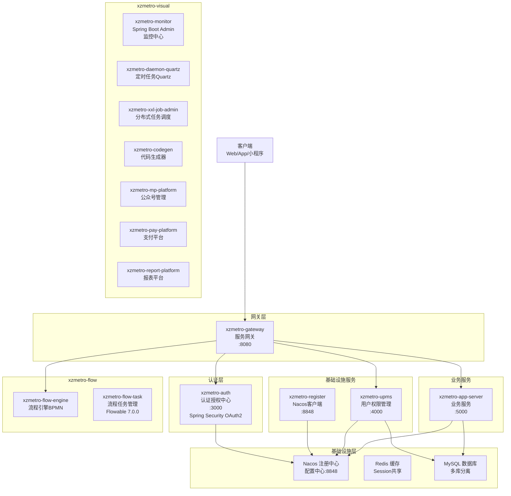
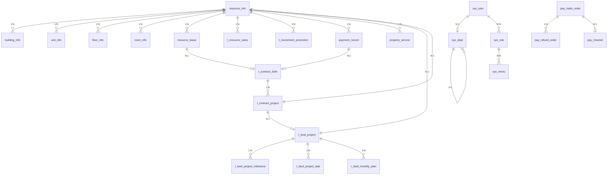

# xzmeto_resource 后端项目深度分析报告

> 分析时间: 2026-04-29
> 项目版本: 5.9.0
> 项目路径: /workspace/self_workspace/projects/xzmeto_resource_backend-main/xzmeto_resource_backend-main/

---

## 一、项目概述

xzmetro 是一个基于 Spring Cloud Alibaba 的微服务架构物业/地产资源管理系统，支持多租户、权限管理、资源租赁销售、土地项目管理等业务功能。

**技术栈版本:**
- Spring Boot: 3.5.3
- Spring Cloud: 2025.0.0
- Spring Cloud Alibaba: 2023.0.3.3
- Java: 17
- 数据库: MySQL 8.0 (utf8mb4)
- 注册中心/配置中心: Alibaba Nacos

---

## 二、架构设计

### 2.1 微服务架构拓扑图



### 2.2 模块职责清单

| 模块名称 | 端口 | 职责 | 技术选型 |
|---------|------|------|---------|
| xzmetro-register | 8848 | Nacos注册中心客户端 | Spring Cloud |
| xzmetro-gateway | 8080 | 服务网关、路由、限流 | Spring Cloud Gateway |
| xzmetro-auth | 3000 | 认证授权、OAuth2 | Spring Security OAuth2 |
| xzmetro-upms | 4000 | 用户、角色、菜单、部门、租户管理 | MyBatis-Plus |
| xzmetro-app-server | 5000 | 核心业务(资源、土地、合同、审批) | MyBatis-Plus |
| xzmetro-flow | - | 流程引擎、任务管理 | Flowable 7.0.0 |
| xzmetro-visual | - | 监控、定时任务、代码生成、支付、报表 | 多种组件 |

---

## 三、数据库设计

### 3.1 多数据库架构

项目采用多库分离设计，包含以下数据库:

| 数据库名 | 用途 | 主要表 |
|---------|------|-------|
| xzmeto_resource | 核心业务数据 | 资源、土地、合同、审批 |
| xzmeto_resource_pay | 支付模块 | 支付订单、退款、渠道 |
| xzmeto_resource_job | 定时任务 | Quartz相关表 |
| xzmeto_resource_bi | BI报表 | 数据统计表 |
| xzmeto_resource_mp | 公众号管理 | 微信相关 |
| xzmeto_resource_codegen | 代码生成 | 生成配置 |

### 3.2 核心业务表清单

#### 3.2.1 资源管理模块 (resource_info)

| 表名 | 中文名 | 核心字段 | 关联关系 |
|------|--------|---------|---------|
| resource_info | 资源信息统一表 | resource_id, resource_code, resource_name, resource_type, parent_resource_id, project_id, resource_status | FK→t_project, FK→resource_info(parent) |
| building_info | 楼栋信息表 | building_id, resource_id, building_code, floors_count, construction_area | FK→resource_info |
| unit_info | 单元信息表 | unit_id, resource_id, unit_code, unit_area | FK→resource_info |
| floor_info | 楼层信息表 | floor_id, resource_id, floor_code, floor_number | FK→resource_info |
| room_info | 房间信息表 | room_id, resource_id, room_code, room_area, daily_rent, monthly_rent | FK→resource_info |

#### 3.2.2 资源业务表

| 表名 | 中文名 | 核心字段 | 关联关系 |
|------|--------|---------|---------|
| resource_lease | 资源租赁表 | lease_id, resource_id, contract_both_id, tenant_name, lease_start_date, lease_end_date, monthly_rent | FK→resource_info, FK→t_contract_both |
| t_resource_sales | 资源销售表 | sales_id, contract_id, resource_id, buyer_name, sales_amount, sales_status | FK→resource_info |
| t_resource_sales_contract | 资源销售合同表 | contract_id, contract_code, customer_name, contract_amount | 独立表 |
| t_investment_promotion | 招商发布表 | promotion_id, resource_id, promotion_type, promotion_status | FK→resource_info |
| payment_record | 缴费记录表 | payment_id, resource_id, payment_type, payment_amount, payment_status | FK→resource_info, FK→t_contract_both |
| property_service | 物业服务表 | service_id, resource_id, service_type, service_status | FK→resource_info |

#### 3.2.3 合同管理模块

| 表名 | 中文名 | 核心字段 | 关联关系 |
|------|--------|---------|---------|
| t_contract_both | 双方合同主表 | id, contract_code, contract_type, owner, contractor, amount, approve_status | 主表 |
| t_contract_both_his | 合同历史表 | id, contract_id(关联原合同) | FK→t_contract_both |
| t_contract_project | 合同项目资源关联表 | id, contract_id, land_project_id, resources_project_id | FK→t_contract_both |
| t_contract_project_his | 合同项目关联历史表 | id, contract_id, con_pro_id | FK→t_contract_project |
| t_contract_measurement | 合同计量表 | id, contract_id, measurement_amount | FK→t_contract_both |
| t_payment_info | 支付信息表 | id, contract_id, pay_amount, pay_type | FK→t_contract_both |
| t_contract_approve_record | 合同审批记录表 | id, contract_id, approve_user, approve_result | FK→t_contract_both |

#### 3.2.4 土地项目管理模块

| 表名 | 中文名 | 核心字段 | 关联关系 |
|------|--------|---------|---------|
| t_land_project | 土地项目表 | project_id, project_code, project_name, land_area, total_investment | 主表 |
| t_land_project_milestone | 项目里程碑表 | milestone_id, project_id, milestone_name, plan_date | FK→t_land_project |
| t_land_project_task | 项目任务表 | task_id, project_id, task_name, responsible | FK→t_land_project |
| t_land_monthly_plan | 月度计划表 | plan_id, project_id, plan_month, plan_content | FK→t_land_project |
| t_land_responsibility_party | 责任方表 | party_id, project_id, party_name, party_type | FK→t_land_project |
| t_land_change_record | 变更记录表 | change_id, project_id, change_type, change_desc | FK→t_land_project |
| t_land_process_node | 流程节点表 | node_id, project_id, node_name, process_key | FK→t_land_project |
| t_land_approval_process | 审批流程表 | approval_id, project_id, approval_type | FK→t_land_project |

#### 3.2.5 系统管理模块 (xzmetrox_boot / xzmeto_resource)

| 表名 | 中文名 | 核心字段 | 关联关系 |
|------|--------|---------|---------|
| sys_user | 用户表 | user_id, username, password, phone, dept_id | FK→sys_dept |
| sys_role | 角色表 | role_id, role_name, role_code | - |
| sys_menu | 菜单表 | menu_id, menu_name, path, component, parent_id | 自关联 |
| sys_dept | 部门表 | dept_id, name, parent_id | 自关联 |
| sys_tenant | 租户表 | tenant_id, tenant_name, tenant_code | - |
| sys_dict | 字典表 | id, dict_type, description | - |
| sys_dict_item | 字典项表 | id, dict_id, item_text, item_value | FK→sys_dict |
| sys_area | 行政区划表 | id, pid, name, adcode, area_type | 自关联 |
| sys_log | 系统日志表 | id, type, title, creator, create_time | - |
| sys_audit_log | 审计日志表 | id, audit_name, before_val, after_val | - |
| sys_route_conf | 路由配置表 | id, route_id, uri, predicates | - |
| sys_file | 文件表 | file_id, file_name, file_url, file_size | - |
| sys_message | 消息表 | id, user_id, title, content, read_flag | FK→sys_user |

#### 3.2.6 支付模块 (xzmeto_resource_pay)

| 表名 | 中文名 | 核心字段 | 关联关系 |
|------|--------|---------|---------|
| pay_channel | 支付渠道表 | id, mch_id, channel_id, channel_name | - |
| pay_trade_order | 支付订单表 | order_id, channel_id, amount, status, subject | - |
| pay_refund_order | 退款订单表 | refund_order_id, pay_order_id, refund_amount, status | FK→pay_trade_order |
| pay_goods_order | 商品订单表 | goods_order_id, goods_id, amount, status | - |
| pay_notify_record | 支付通知记录表 | id, order_no, request, response | - |

#### 3.2.7 定时任务模块 (xzmeto_resource_job)

基于 Quartz 的分布式定时任务表:

| 表名 | 中文名 |
|------|--------|
| qrtz_triggers | 触发器表 |
| qrtz_job_details | 任务详情表 |
| qrtz_cron_triggers | Cron触发器表 |
| qrtz_simple_triggers | 简单触发器表 |
| qrtz_fired_triggers | 已触发触发器表 |
| qrtz_calendars | 日历表 |
| qrtz_blob_triggers | Blob触发器表 |

### 3.3 核心 ER 关系图



---

## 四、业务模块划分

### 4.1 UPMS 模块 (xzmetro-upms)

**职责:** 用户权限管理系统

**子模块:**
- xzmetro-upms-api: API接口定义
- xzmetro-upms-biz: 业务实现
- xzmetro-upms-common: 公共组件

**业务控制器:**
- `SysUserController` - 用户管理
- `SysRoleController` - 角色管理
- `SysMenuController` - 菜单管理
- `SysDeptController` - 部门管理
- `SysTenantController` - 租户管理
- `SysDictController` - 字典管理
- `SysAreaController` - 行政区划
- `SysLogController` - 日志管理
- `SysMessageController` - 消息管理
- `SysTokenController` - Token管理
- `SysSocialDetailsController` - 社交登录
- `AiChatController` - AI聊天

### 4.2 APP 模块 (xzmetro-app-server)

**职责:** 核心业务服务

**子模块:**
- xzmetro-app-server-api: API接口定义
- xzmetro-app-server-biz: 业务实现

**业务控制器:**

#### 4.2.1 资源管理
- `AppResourceInfoController` - 资源信息管理
- `AppResourceRoomController` - 资源房间管理

#### 4.2.2 土地项目管理
- `LandProjectController` - 土地项目管理
- `LandProjectMilestoneController` - 项目里程碑
- `LandProjectTaskController` - 项目任务管理
- `LandMonthlyPlanController` - 月度计划
- `LandResponsibilityPartyController` - 责任方管理
- `LandChangeRecordController` - 变更记录
- `LandProcessNodeController` - 流程节点
- `LandApprovalProcessController` - 审批流程
- `LandProcessTemplateController` - 流程模板
- `LandTaskManagementController` - 任务管理
- `LandStatisticsController` - 统计报表
- `LandLeaderboardStatisticsController` - 排行榜统计
- `LandFlowChartController` - 流程图

#### 4.2.3 合同管理
- `ContractBothController` - 双方合同管理
- `ContractMeasurementController` - 合同计量
- `ContractApproveRecordController` - 审批记录
- `PaymentInfoController` - 支付信息

#### 4.2.4 地铁站点管理
- `LineController` - 线路管理
- `StationController` - 站点管理

#### 4.2.5 审批管理
- `ApplyController` - 申请管理
- `ApplyReceiveController` - 审批接收

#### 4.2.6 进度管理
- `ProgressNodesController` - 进度节点

#### 4.2.7 其他
- `AppIndexController` - 首页
- `AppUserController` - 用户管理
- `AppCustomerController` - 客户管理
- `AppDictController` - 字典
- `AppPageController` - 页面配置
- `AppArticleController` - 文章管理
- `AppArticleCategoryController` - 文章分类
- `AppArticleCollectController` - 文章收藏
- `AppRoleController` - 角色管理
- `AppUserRoleController` - 用户角色
- `AppSocialDetailsController` - 社交详情
- `AppTokenController` - Token管理
- `AppUserMsgController` - 用户消息
- `AppTabbarController` - TabBar配置
- `AppMobileController` - 移动端配置
- `AppSysFileController` - 文件管理
- `MiniAppController` - 小程序
- `UserFavoritesController` - 用户收藏

### 4.3 FLOW 模块 (xzmetro-flow)

**职责:** 流程引擎服务

**子模块:**
- xzmetro-flow-engine: 流程引擎
- xzmetro-flow-task: 流程任务

**依赖:** Flowable 7.0.0 BPMN引擎

### 4.4 VISUAL 模块 (xzmetro-visual)

**职责:** 可视化辅助服务

**子模块:**
| 子模块 | 职责 |
|-------|------|
| xzmetro-monitor | Spring Boot Admin 监控中心 |
| xzmetro-daemon-quartz | Quartz定时任务 |
| xzmetro-daemon-elastic-job | ElasticJob分布式任务 |
| xzmetro-xxl-job-admin | XXL-Job任务调度平台 |
| xzmetro-codegen | 代码生成器 |
| xzmetro-mp-platform | 微信公众号管理 |
| xzmetro-pay-platform | 聚合支付平台 |
| xzmetro-report-platform | 报表平台 |
| xzmetro-jimu-platform | 积木报表 |
| xzmetro-swagger | API文档 |

### 4.5 COMMON 模块 (xzmetro-common)

**职责:** 公共组件库

| 组件 | 职责 |
|------|------|
| xzmetro-common-core | 核心工具类 |
| xzmetro-common-security | 安全认证 |
| xzmetro-common-gateway | 网关公共 |
| xzmetro-common-feign | 服务调用 |
| xzmetro-common-log | 日志组件 |
| xzmetro-common-audit | 审计组件 |
| xzmetro-common-sentinel | Sentinel限流熔断 |
| xzmetro-common-gray | 灰度发布 |
| xzmetro-common-data | 数据操作 |
| xzmetro-common-datasource | 多数据源 |
| xzmetro-common-swagger | Swagger文档 |
| xzmetro-common-oss | 对象存储 |
| xzmetro-common-excel | Excel导入导出 |
| xzmetro-common-sse | SSE服务端推送 |
| xzmetro-common-websocket | WebSocket通信 |
| xzmetro-common-idempotent | 幂等组件 |
| xzmetro-common-encrypt-api | API加解密 |
| xzmetro-common-sensitive | 敏感词过滤 |
| xzmetro-common-sequence | 分布式序列 |
| xzmetro-common-job | 任务调度公共 |

---

## 五、核心业务流程

### 5.1 资源管理流程

```
土地项目创建 → 资源项目创建 → 楼栋/单元/楼层/房间创建 → 资源招商发布
                                                          ↓
                                            租赁/销售签约 → 缴费管理
                                                          ↓
                                            物业服务 → 审批流程
```

### 5.2 合同管理流程

```
合同创建 → 项目资源关联 → 合同审批 → 审批通过
                                    ↓
                        计量支付 → 支付完成
                                    ↓
                        合同归档
```

### 5.3 土地项目流程

```
项目创建 → 里程碑规划 → 任务分解 → 月度计划执行
                                    ↓
                        流程节点审批 → 变更记录
                                    ↓
                        项目验收 → 统计报表
```

### 5.4 支付流程

```
商品订单创建 → 支付渠道选择 → 发起支付 → 支付回调
                                      ↓
                        支付成功 → 订单状态更新
                                      ↓
                        退款申请 → 退款处理
```

---

## 六、技术特性

### 6.1 多租户支持
- 基于 `tenant_id` 字段隔离
- 数据访问层自动租户过滤

### 6.2 安全特性
- Spring Security OAuth2 认证
- JWT Token
- 滑块验证码
- API加解密
- Sentinel 限流熔断

### 6.3 监控运维
- Spring Boot Admin 监控
- 自定义审计日志
- 操作日志记录

### 6.4 代码质量
- Checkstyle 代码规范
- Git Commit 信息嵌入
- Lombok 简化代码

---

## 七、数据库字典

### 7.1 资源状态枚举 (resource_status)
| 状态值 | 说明 |
|--------|------|
| VACANT | 空置中 |
| LEASED | 已租赁 |
| SOLD | 已销售 |
| PROMOTION | 招商中 |
| MAINTENANCE | 维护中 |

### 7.2 资源类型枚举 (resource_type)
| 类型值 | 说明 |
|--------|------|
| PROJECT | 项目 |
| BUILDING | 楼栋 |
| UNIT | 单元 |
| FLOOR | 楼层 |
| ROOM | 房间 |
| LAND | 零星土地 |
| CHANNEL | 接口通道 |

### 7.3 租赁状态枚举 (lease_status)
| 状态值 | 说明 |
|--------|------|
| ACTIVE | 生效中 |
| EXPIRED | 已到期 |
| TERMINATED | 已终止 |
| PENDING | 待生效 |

### 7.4 缴费类型枚举 (payment_type)
| 类型值 | 说明 |
|--------|------|
| RENT | 租金 |
| DEPOSIT | 押金 |
| PROPERTY | 物业费 |
| UTILITIES | 水电费 |
| OTHER | 其他 |

---

## 八、配置文件

### 8.1 bootstrap.yml 配置
- Nacos 注册中心地址
- Nacos 配置中心地址
- 应用端口配置
- 多环境 profile 支持

### 8.2 application.yml 配置
- MySQL 数据源配置
- Redis 缓存配置
- Swagger 文档配置
- Flowable 流程引擎配置

---

## 九、总结

xzmetro_resource 是一个功能完善的物业/地产资源管理微服务系统，具有以下特点:

1. **微服务架构清晰**: 认证、网关、业务分离，支持水平扩展
2. **多租户设计**: 完善的租户隔离机制
3. **业务模块完整**: 涵盖资源、土地、合同、支付、审批等核心业务
4. **技术栈先进**: 基于 Spring Cloud Alibaba 2025，Java 17
5. **可维护性强**: 模块化设计，公共组件复用
6. **扩展性好**: 支持 Flowable 流程引擎、XXL-Job 任务调度

---

*报告生成完成*
