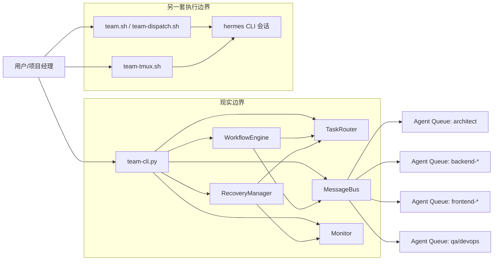

# AI Agent 团队调度框架独立评估报告

## 摘要

本次评估基于 **当前磁盘代码与脚本的独立审查**，不引用历史结论作为前提。评估范围覆盖 `调度框架` 目录下 **6 个 Python 文件、3 个 Bash 脚本、2 份核心说明文档、1 份工作流文档与 1 份操作日志**，并对关键行为进行了代码级复现。结论是：当前框架已经具备 **“可演示的本地多 Agent 协作原型”** 形态，但尚未达到 **“稳定、可信、可扩展的团队级调度系统”** 水平。

当前实现的主要优势在于：模块边界已经初步分层，`task_router`、`message_bus`、`workflow_engine`、`monitor` 四大核心模块已成型；CLI 提供了统一入口；团队角色模型与流程文档较完整，便于组织协作与后续重构。

核心风险主要集中在三类：

1. **执行正确性风险高**：监控仪表盘存在可复现死锁；工作流步骤声明的 `agent` 字段未被真正执行层尊重；恢复策略和等待队列存在文档与代码不一致。
2. **系统边界过弱**：消息总线是单进程内存对象，不支持跨进程共享；Shell/tmux 与 Python 核心是两套并行世界，框架整体缺少统一控制平面。
3. **治理能力不足**：未发现认证、授权、审计持久化、测试基线和 CI 验证，安全与工程成熟度明显偏低。

综合评分（100 分制）如下：架构清晰度 `62`，功能完整性 `54`，协作效率 `58`，性能弹性 `40`，安全治理 `32`，可扩展性 `46`。这意味着该框架适合继续作为 **内部原型/实验平台** 演进，但不建议在现状下承担高并发、多项目、强审计要求的真实生产编排职责。

## 1. 评估范围与方法

### 1.1 评估对象

- 目录：`d:\KIMIK2.5\AIAgent\.hermes\team\调度框架`
- 核心模块：
  - [team-cli.py](file:///d:/KIMIK2.5/AIAgent/.hermes/team/调度框架/cli/team-cli.py)
  - [task_router.py](file:///d:/KIMIK2.5/AIAgent/.hermes/team/调度框架/core/task_router.py)
  - [message_bus.py](file:///d:/KIMIK2.5/AIAgent/.hermes/team/调度框架/core/message_bus.py)
  - [workflow_engine.py](file:///d:/KIMIK2.5/AIAgent/.hermes/team/调度框架/core/workflow_engine.py)
  - [monitor.py](file:///d:/KIMIK2.5/AIAgent/.hermes/team/调度框架/core/monitor.py)
- 辅助脚本：
  - [team.sh](file:///d:/KIMIK2.5/AIAgent/.hermes/team/调度框架/team.sh)
  - [team-dispatch.sh](file:///d:/KIMIK2.5/AIAgent/.hermes/team/调度框架/scripts/team-dispatch.sh)
  - [team-tmux.sh](file:///d:/KIMIK2.5/AIAgent/.hermes/team/调度框架/tmux/team-tmux.sh)

### 1.2 评估方法

- 静态代码审查：逐文件阅读核心实现与文档。
- 关键缺陷复现：
  - `Monitor.get_dashboard_data()` 死锁复现：调用 1 秒后线程仍未返回。
  - 标准工作流路由复现：`database`、`backend_dev`、`frontend_dev` 等步骤出现与声明 `agent` 不一致的实际路由结果。
- 模式扫描：
  - 风险语义：`eval`
  - 并发语义：`Lock`、`ThreadPoolExecutor`、`PriorityQueue`
  - 工程基线：测试文件与测试代码痕迹
- 结构量化：Python 核心代码共 `1,967 LOC / 20 classes / 76 functions`。

### 1.3 关键定量事实

| 指标 | 当前值 | 说明 |
|------|--------|------|
| Python 文件数 | 6 | 仅 `core` + `cli` |
| Python LOC | 1,967 | 以 AST 脚本统计 |
| Bash 脚本数 | 3 | `team.sh`、`team-dispatch.sh`、`team-tmux.sh` |
| 自动化测试文件 | 0 | `调度框架` 目录下未发现测试文件 |
| 核心单例组件 | 4 | Router / Bus / Monitor / Recovery |
| 关键可复现缺陷 | 2 | 仪表盘死锁、工作流指定 Agent 失效 |
| 配置重复定义点 | 4+ | Python Router、CLI 逻辑、Shell 脚本、tmux 脚本 |

## 2. 当前架构图梳理

### 2.1 逻辑架构

### 2.2 架构解读

- Python 核心是 **单进程内的内存调度器**，核心由 [__init__.py](file:///d:/KIMIK2.5/AIAgent/.hermes/team/调度框架/core/__init__.py) 暴露单例。
- 新版主入口是 [team-cli.py](file:///d:/KIMIK2.5/AIAgent/.hermes/team/调度框架/cli/team-cli.py#L33-L347)，旧入口仍保留在 [team.sh](file:///d:/KIMIK2.5/AIAgent/.hermes/team/调度框架/team.sh) 与 [team-dispatch.sh](file:///d:/KIMIK2.5/AIAgent/.hermes/team/调度框架/scripts/team-dispatch.sh)。
- `tmux` 层通过 [team-tmux.sh](file:///d:/KIMIK2.5/AIAgent/.hermes/team/调度框架/tmux/team-tmux.sh#L68-L165) 的 `tmux send-keys` 向终端注入文本，本质上是 **人机界面自动化**，不是程序级 RPC。
- 因此当前框架不是“统一调度平面”，而是 **内存原型 + Shell 包装 + tmux 会话控制** 的混合架构。

### 2.3 代码规模分布

观察点：

- [workflow_engine.py](file:///d:/KIMIK2.5/AIAgent/.hermes/team/调度框架/core/workflow_engine.py) 和 [monitor.py](file:///d:/KIMIK2.5/AIAgent/.hermes/team/调度框架/core/monitor.py) 代码量最大，但运行闭环并未对应最强。
- 复杂度集中在执行编排与观测面，而这两部分恰好是当前问题最集中的区域。

## 3. 模块功能完整性评估

### 3.1 总览评分

| 模块 | 设计目标 | 当前完成度 | 主要缺口 | 评价 |
|------|----------|------------|----------|------|
| Task Router | 智能分类、负载均衡、任务分配 | 中等 | 分类过度依赖关键词，未知任务会漂移到非预期角色，未实现真实排队 | 可用但脆弱 |
| Message Bus | P2P/广播/组播/订阅 | 中等 | 仅单进程有效，无持久化、无 ACK、无消费状态、锁粒度偏粗 | 原型级 |
| Workflow Engine | 顺序/并行/条件/循环/人工审核 | 中低 | 指定 `agent` 不生效，ready step 不真正并行，无持久状态机 | 表达力强，执行力弱 |
| Monitor | 指标、日志、告警、仪表盘 | 低 | 默认未启动巡检线程，仪表盘可死锁，日志仅内存/控制台 | 设计大于实现 |
| Recovery Manager | 重试、故障转移 | 低 | 仅返回动作描述，未真正重派任务 | 名义存在 |
| CLI | 状态查看、调度、广播、工作流、监控 | 中等 | 与监控/恢复未形成闭环，仍依赖 `sys.path` 注入 | 演示入口可用 |
| Shell/tmux | 快速调度、多窗口协作 | 中等 | 与 Python 核心割裂，跨平台性弱，存在旧参数痕迹 | 便捷但分裂 |

### 3.2 Task Router 评估

优势：

- 任务模型、Agent 模型、评分模型结构清晰，核心路由逻辑集中在 [route_task()](file:///d:/KIMIK2.5/AIAgent/.hermes/team/调度框架/core/task_router.py#L160-L207)。
- 评分规则可解释，包含技能匹配、负载、成功率、响应时间四项。

问题：

- [classify_task()](file:///d:/KIMIK2.5/AIAgent/.hermes/team/调度框架/core/task_router.py#L123-L135) 采用关键词计数法，`设计`、`测试`、`UI` 等词同时出现在多个角色词典中，误分风险高。
- 当所有 Agent 满载时，[route_task()](file:///d:/KIMIK2.5/AIAgent/.hermes/team/调度框架/core/task_router.py#L197-L200) 并不是“排队等待”，而是选择当前任务数最少的 Agent，文档描述与实现不符。
- `avg_response_time` 与 `started_at` 未形成完整生命周期，实际评分数据长期可能失真。

结论：

- Router 可以做“默认推荐”，但不应在需要强约束角色分工的流程中作为唯一真相源。

### 3.3 Message Bus 评估

优势：

- `PriorityQueue` 设计使优先级与时间顺序具备基本可用性。
- 支持 P2P、广播、组播和订阅回调，API 简洁。

问题：

- [MessageBus.send()](file:///d:/KIMIK2.5/AIAgent/.hermes/team/调度框架/core/message_bus.py#L114-L165) 在持锁状态下触发 [_notify_subscribers()](file:///d:/KIMIK2.5/AIAgent/.hermes/team/调度框架/core/message_bus.py#L201-L209)，回调重入总线会带来阻塞/级联风险。
- `消息持久化` 只表现为 `_history` 内存列表，不是外部持久化，进程结束即丢失。
- 没有消息确认、消费位点、幂等键、重试队列与死信队列，无法支撑真实协作编排。
- 单例只在 Python 进程内共享；如果通过多个 CLI/脚本/会话启动，则不共享状态。

结论：

- 这是“进程内事件分发器”，不是“团队级消息总线”。

### 3.4 Workflow Engine 评估

优势：

- [create_standard_project_workflow()](file:///d:/KIMIK2.5/AIAgent/.hermes/team/调度框架/core/workflow_engine.py#L448-L515) 把项目流程抽象为结构化步骤，表达能力较好。
- 支持顺序、并行、条件、循环和人工审核，模型上具备扩展潜力。

问题：

- [WorkflowStep.agent](file:///d:/KIMIK2.5/AIAgent/.hermes/team/调度框架/core/workflow_engine.py#L31-L50) 被定义出来，但 [_execute_agent_task()](file:///d:/KIMIK2.5/AIAgent/.hermes/team/调度框架/core/workflow_engine.py#L297-L313) 仍调用 `route_task(task_content)` 自动路由，**没有优先使用 `step.agent`**。
- 复现结果显示：
  - `database` 步骤声明 `dba`，实际被路由到 `architect`
  - `backend_dev` 中“编写单元测试”被路由到 `qa-functional`
  - `frontend_dev` 中“对接后端API”被路由到 `backend-2`
- `ready_steps` 在 [execute_workflow()](file:///d:/KIMIK2.5/AIAgent/.hermes/team/调度框架/core/workflow_engine.py#L161-L199) 中仍逐个执行，不是真正的 DAG 并发调度。
- 条件执行依赖 [eval(expr, {"__builtins__": {}}, allowed_names)](file:///d:/KIMIK2.5/AIAgent/.hermes/team/调度框架/core/workflow_engine.py#L394-L406)，属于高风险实现。

结论：

- 引擎有 DSL 雏形，但当前更像“流程模拟器”而不是“可信工作流运行时”。

### 3.5 Monitor / Recovery 评估

优势：

- 指标、日志、告警、恢复管理器已经拆分成独立对象。
- 阈值设计和恢复策略接口具备继续演进基础。

问题：

- CLI 初始化 [TeamCLI.__init__()](file:///d:/KIMIK2.5/AIAgent/.hermes/team/调度框架/cli/team-cli.py#L36-L45) 未调用 `monitor.start()`，监控线程默认不运行。
- [get_dashboard_data()](file:///d:/KIMIK2.5/AIAgent/.hermes/team/调度框架/core/monitor.py#L264-L289) 在持有 `threading.Lock` 时再调用 [get_alerts()](file:///d:/KIMIK2.5/AIAgent/.hermes/team/调度框架/core/monitor.py#L223-L248) 与 [get_logs()](file:///d:/KIMIK2.5/AIAgent/.hermes/team/调度框架/core/monitor.py#L250-L262)，会触发不可重入死锁。
- [RecoveryManager._failover()](file:///d:/KIMIK2.5/AIAgent/.hermes/team/调度框架/core/monitor.py#L366-L394) 只降低 `success_rate` 并返回说明，不会真正创建重派动作。

结论：

- 可观测性模块目前既不稳定，也没有真正闭环到调度执行。

## 4. 技术债务识别

### 4.1 结构性技术债

| 债务项 | 证据 | 影响 |
|--------|------|------|
| 新旧入口并存且行为割裂 | CLI + Shell + tmux 同时存在 | 维护成本高，用户认知混乱 |
| Agent 配置多处重复 | Python Router、Shell 脚本、tmux 脚本分别维护 | 配置漂移风险高 |
| 单进程单例充当系统边界 | `get_router()`、`get_bus()`、`get_monitor()` | 无法扩展到多进程/多实例 |
| 文档与代码能力不一致 | README 声称排队/持久化/故障转移 | 误导用户，掩盖风险 |

### 4.2 正确性技术债

| 债务项 | 证据 | 影响 |
|--------|------|------|
| 工作流步骤不遵守指定角色 | `step.agent` 未被执行层强制使用 | 破坏职责边界 |
| 仪表盘接口死锁 | `Lock` 重入调用 | 监控面板不可用 |
| 故障转移未真正发生 | 仅修改评分并返回描述 | 故障恢复名存实亡 |
| 队列语义被文档夸大 | 满载时直接挑最低负载 | 无法保障公平排队 |

### 4.3 工程化技术债

| 债务项 | 当前状态 | 影响 |
|--------|----------|------|
| 自动化测试缺失 | 未发现测试文件 | 回归风险高 |
| CI 校验缺失 | 未见框架自身验证链路 | 演进不可控 |
| 配置中心缺失 | 配置硬编码在源码与脚本 | 扩展成本高 |
| 统一日志后端缺失 | 仅内存 + 控制台输出 | 无法审计与追溯 |

## 5. 性能瓶颈分析

### 5.1 主要瓶颈

| 瓶颈 | 位置 | 影响机制 | 风险等级 |
|------|------|----------|----------|
| 全局锁串行化发送 | [MessageBus.send()](file:///d:/KIMIK2.5/AIAgent/.hermes/team/调度框架/core/message_bus.py#L114-L165) | 所有发送与订阅通知串行执行 | 高 |
| 锁内调用二次加锁接口 | [Monitor.get_dashboard_data()](file:///d:/KIMIK2.5/AIAgent/.hermes/team/调度框架/core/monitor.py#L264-L289) | 直接卡死 | 高 |
| DAG ready step 串行处理 | [WorkflowEngine.execute_workflow()](file:///d:/KIMIK2.5/AIAgent/.hermes/team/调度框架/core/workflow_engine.py#L178-L199) | 并发度受限 | 中 |
| 内存态日志/历史/指标 | `logs`、`alerts`、`_history` | 容量受单进程限制，无法水平扩展 | 中 |
| 文本注入式 tmux 协作 | [team-tmux.sh](file:///d:/KIMIK2.5/AIAgent/.hermes/team/调度框架/tmux/team-tmux.sh#L144-L165) | 自动化效率低、不可观测 | 中 |

### 5.2 已复现问题

通过独立脚本调用 `Monitor.get_dashboard_data()`，1 秒后线程仍未返回，证明当前版本存在**确定性卡死**，这不是理论风险而是现网级正确性缺陷。

### 5.3 性能成熟度评分

评分说明：

- 采用 100 分制，综合考察结构清晰度、运行正确性、治理能力、工程化基线与扩展支撑。
- 分数不是“拍脑袋印象”，而是基于当前可观察实现能力与缺口的专家评估值，用于建立整改前基线。

## 6. 安全漏洞扫描结果

### 6.1 扫描范围与结论

- 已扫描关键模式：`eval`、认证/授权关键词、测试与治理痕迹。
- 结果：
  - 发现 `eval` 使用 `1` 处
  - 未发现明确的认证/授权/审计持久化实现
  - 未发现自动化测试基线

### 6.2 主要安全问题

| 问题 | 证据 | 影响 | 风险等级 |
|------|------|------|----------|
| 动态表达式执行 | [workflow_engine.py:L394-L406](file:///d:/KIMIK2.5/AIAgent/.hermes/team/调度框架/core/workflow_engine.py#L394-L406) | 条件表达式可能被滥用，存在执行与资源消耗风险 | 高 |
| 无认证与授权边界 | 框架目录内未发现 auth/permission/audit 实现 | 任意调度、广播、交接缺少权限治理 | 高 |
| 无审计持久化 | 消息/日志均以内存为主 | 难以满足合规与问题追责 | 中高 |
| tmux 文本注入式控制 | [team-tmux.sh:L145-L165](file:///d:/KIMIK2.5/AIAgent/.hermes/team/调度框架/tmux/team-tmux.sh#L145-L165) | 命令与消息边界不清晰，误操作不可控 | 中 |
| `sys.path` 动态注入 | [team-cli.py:L15-L18](file:///d:/KIMIK2.5/AIAgent/.hermes/team/调度框架/cli/team-cli.py#L15-L18) | 运行环境污染与导入路径漂移风险 | 中 |

### 6.3 安全建议底线

- 去除 `eval`，替换为受限表达式解释器或显式条件 DSL。
- 为调度、广播、工作流执行增加最小权限模型。
- 对关键操作输出结构化审计日志并落盘。
- 将“Agent 身份、会话、授权范围”从脚本层提升到统一控制平面。

## 7. 团队协作效率评估

### 7.1 正向因素

- 团队角色定义完整，流程文档覆盖需求、设计、开发、测试、部署。
- 标准工作流把跨角色交付逻辑结构化，便于培训与演示。
- Shell/tmux 工具在小团队内能快速组织多人并行窗口。

### 7.2 协作效率瓶颈

| 协作问题 | 现象 | 影响 |
|----------|------|------|
| 控制平面分裂 | Python 核心与 Shell/tmux 各自运转 | 状态不同步，协作链路不可追踪 |
| 任务交付不具备强约束 | 工作流声明角色但执行不遵守 | 责任边界模糊 |
| 共享上下文不标准 | 文本广播/消息内容自由格式 | Handoff 质量不稳定 |
| 结果不可审计 | 缺少统一事件流和存档 | 复盘成本高 |
| 真实集成深度浅 | 框架外未发现明显调用方 | 目前更像独立原型，不是平台能力 |

### 7.3 协作效率判断

- 在 **1 位 PM + 少量固定角色** 的人工驱动模式下，当前框架可提升任务分发效率。
- 一旦进入 **多项目并发、跨会话接力、失败恢复、过程追踪** 场景，当前机制会迅速暴露缺陷。
- 综合判断：协作效率 **中等偏低，可演示但难以规模化复用**。

## 8. 与业界最佳实践的差距对比

| 维度 | 当前实现 | 业界成熟实践 | 差距判断 |
|------|----------|--------------|----------|
| 调度边界 | 单进程单例 | 独立控制平面 + 可持久状态 | 大 |
| 消息通信 | 进程内队列 | 持久化事件总线 / MQ / 任务队列 | 大 |
| 工作流执行 | 代码内循环驱动 | 显式状态机 / DAG runtime / durable execution | 大 |
| 权限治理 | 基本缺失 | RBAC、审计、操作留痕 | 大 |
| 可观测性 | 控制台 + 内存日志 | 指标、日志、追踪三件套 + 告警闭环 | 大 |
| 工程质量 | 无自动测试 | 单元测试 + 集成测试 + CI Gate | 大 |
| 配置管理 | 多处硬编码 | 单一配置源 + 环境配置分层 | 中大 |
| 插件扩展 | 靠改源码 | 插件接口、协议化任务、扩展注册中心 | 中大 |

## 9. 主要问题分布

说明：

- 该图将识别出的关键问题按“主责维度”归类，只计入一个主类别，避免重复统计。
- 架构与集成、执行正确性问题占比最高，说明当前最紧迫的不是“再加功能”，而是先修控制平面与运行正确性。

## 10. 优化建议清单（按优先级排序）

### P0：两周内必须完成

| 优先级 | 建议 | 目标 |
|--------|------|------|
| P0-1 | 修复监控死锁：`Lock` 改为 `RLock` 或拆分内部无锁方法，避免锁内再调加锁接口 | 仪表盘调用 100% 可返回 |
| P0-2 | 修复工作流执行语义：若 `step.agent` 非空则强制定向执行，禁止被 `route_task()` 覆盖 | 标准工作流角色命中率达到 100% |
| P0-3 | CLI 初始化时显式启动/停止 Monitor，补上生命周期管理 | 告警检查真正生效 |
| P0-4 | 为 Router / Workflow / Monitor 补最小回归测试集 | 核心路径覆盖率达到 60% 以上 |
| P0-5 | README 与代码能力对齐，删除“持久化/排队等待/已故障转移”等夸大描述 | 文档与代码一致 |

### P1：一个月内完成

| 优先级 | 建议 | 目标 |
|--------|------|------|
| P1-1 | 抽离统一配置中心，集中维护 Agent 元数据、组配置、阈值、脚本映射 | 配置单一事实源 |
| P1-2 | 将消息总线升级为“持久化任务/事件存储 + 消费确认”模型 | 跨进程消息可追踪 |
| P1-3 | 为工作流引擎引入显式状态持久化与执行日志 | 工作流可恢复、可审计 |
| P1-4 | 替换 `eval` 为安全表达式解释器/DSL | 高风险安全点清零 |
| P1-5 | 统一新旧入口，只保留一个主控制平面，其他脚本退化为适配层 | 降低维护复杂度 |

### P2：两到三个月内完成

| 优先级 | 建议 | 目标 |
|--------|------|------|
| P2-1 | 引入插件式 Agent Provider / Executor 接口 | 支持多种执行后端 |
| P2-2 | 增加 RBAC、审计日志、操作审批点 | 满足团队治理要求 |
| P2-3 | 建立指标、日志、追踪三位一体的观测体系 | 关键流程可追溯 |
| P2-4 | 支持真正的跨会话协作协议和 Handoff Schema | 团队协作标准化 |
| P2-5 | 接入 CI，纳入静态检查、单元测试、集成测试与示例工作流验收 | 稳定演进 |

## 11. 实施路线图与时间规划

### 11.1 路线图

| 阶段 | 时间 | 重点任务 | 交付物 |
|------|------|----------|--------|
| Phase 1 | 第 1-2 周 | 修正确性缺陷、建立测试基线、修正文档 | 可运行 P0 版本 |
| Phase 2 | 第 3-6 周 | 配置中心、持久化事件流、统一控制入口 | v2.5 内核 |
| Phase 3 | 第 7-10 周 | 安全治理、审计与观测体系、跨进程执行 | 平台化雏形 |
| Phase 4 | 第 11-12 周 | 插件化、CI/CD、演练与压测 | 可规模化版本 |

### 11.2 建议里程碑

1. **M1（第 2 周末）**：监控不再死锁，标准工作流角色命中正确，新增回归测试。
2. **M2（第 6 周末）**：消息/任务具备持久化和消费确认，Shell/tmux 成为适配层而非主逻辑。
3. **M3（第 10 周末）**：引入权限模型、审计留痕、统一观测面。
4. **M4（第 12 周末）**：完成一次真实项目试运行与故障演练。

## 12. 可量化改进目标

| 指标 | 当前基线 | 目标值 | 期限 |
|------|----------|--------|------|
| 仪表盘可用性 | 存在死锁 | 100% 请求可返回 | 2 周 |
| 标准工作流角色命中率 | 低于 100% | 100% | 2 周 |
| 自动化测试文件数 | 0 | >= 8 | 4 周 |
| 核心路径覆盖率 | 0% 基线缺失 | >= 60% | 4 周 |
| 文档与实现一致性问题 | 多处 | 0 个重大不一致 | 2 周 |
| 配置源数量 | 4+ | 1 | 6 周 |
| 跨进程任务可追踪率 | 0% | >= 90% | 8 周 |
| 高风险安全点 | 2+ | 0 个未处理高风险点 | 8 周 |
| 故障恢复自动闭环率 | 接近 0% | >= 80% | 10 周 |

## 13. 预期收益与风险评估

### 13.1 预期收益

| 收益项 | 预期效果 |
|--------|----------|
| 正确性提升 | 避免工作流误分配与监控卡死 |
| 协作效率提升 | 任务交接与角色边界更清晰 |
| 运维效率提升 | 日志、指标、审计具备统一入口 |
| 扩展能力提升 | 后续可接入更多 Agent、执行器和外部系统 |
| 信任度提升 | 文档、代码、运行结果三者一致 |

### 13.2 实施风险

| 风险 | 说明 | 缓解方案 |
|------|------|----------|
| 重构期间行为波动 | 新旧入口并存时容易产生兼容问题 | 分阶段切换，先加适配层 |
| 事件总线升级复杂 | 从内存态到持久化会涉及语义调整 | 先实现事件落盘，再切换消费模型 |
| 测试补建成本高 | 当前无测试基线 | 先覆盖 P0 路径，再扩展 |
| 团队使用习惯迁移 | Shell/tmux 用户可能依赖旧方式 | 保留过渡层，增加使用文档 |

## 14. 最终判断

当前 AI Agent 团队框架的最大问题，不是“功能太少”，而是 **控制平面不统一、运行语义不严格、治理能力太薄弱**。它已经具备不错的模块化起点，也具备流程表达能力，但目前的落地形态更接近 **实验性编排器**，并不等同于一个可靠的“团队操作系统”。

如果继续在现状上叠加新功能，复杂度会进一步上升，且会把错误语义、分裂入口与不完整恢复机制固化为长期债务。更合理的策略是：**先收敛入口、修正确性、建立测试和审计底座，再谈平台化扩展**。

从投入产出比看，这个框架值得继续演进，但前提是明确阶段目标：**2 周补正确性，6 周补控制平面，12 周完成平台化雏形**。若能按该路线推进，其价值将从“演示原型”提升为“可用于真实项目协作的多 Agent 编排底座”。
