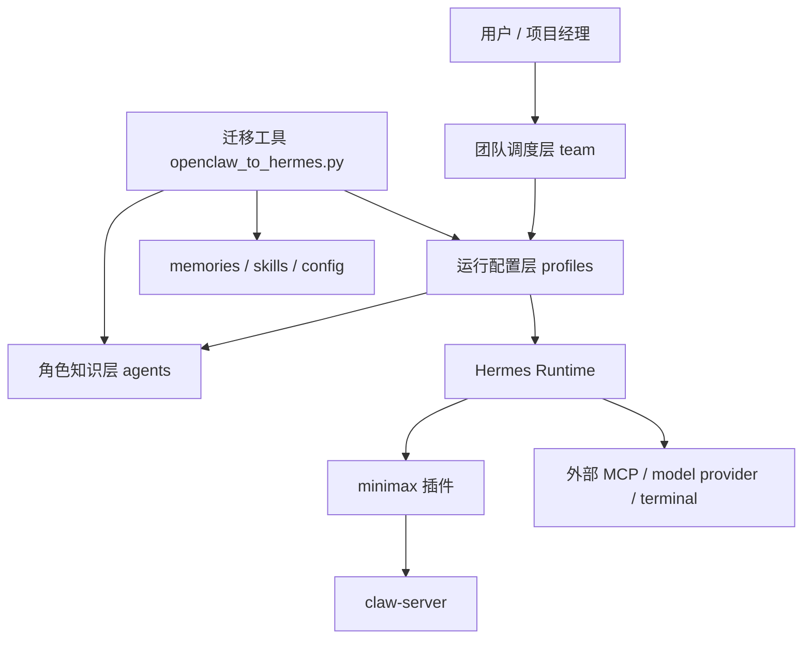

# AIAgent / Hermes Agent 仓库 Code Wiki

> 生成时间：2026-05-12  
> 适用范围：当前 `/workspace` 仓库快照  
> 文档目的：帮助维护者快速理解仓库的整体架构、模块职责、关键实现、依赖关系与运行方式

## 1. 项目概述

该仓库本质上不是传统的单体应用或前后端业务系统，而是一套围绕 `Hermes Agent` 的团队化 AI Agent 资产仓库。它由以下几类内容共同组成：

1. `Agent 模板`：按角色沉淀的知识库、行为规范与配置。
2. `运行 Profile`：面向具体团队成员的运行时配置入口。
3. `调度框架`：通过脚本和 `tmux` 将多个 Agent 组织成协作团队。
4. `插件系统`：当前最核心的是 `minimax` 插件，用于将 Hermes 事件桥接到外部 `claw-server`。
5. `迁移工具`：用于将 OpenClaw 生态中的用户状态迁移到 Hermes。

如果把这个仓库看成一个系统，它更像是：

- 一套可复用的 Agent 组织标准
- 一套 Hermes 运行时的本地分发包
- 一套与外部平台通信的插件扩展
- 一组团队工作流和迁移运维工具

## 2. 顶层目录结构

```text
/workspace
├── README.md
├── LICENSE
├── 团队流程规范.md
└── .hermes/
    ├── agents/          # 角色级 Agent 模板与知识库
    ├── profiles/        # 具体成员运行 Profile
    ├── team/            # 团队组织、调度框架、工作流
    ├── plugins/         # Hermes 插件
    ├── skills/          # 技能定义与迁移工具
    ├── memories/        # 长期记忆文件
    ├── projects/        # 团队共享项目资料
    └── SOUL.md          # Hermes 全局人格入口
```

## 3. 架构分层

### 3.1 分层视图



### 3.2 五层模型

| 层级 | 目录 | 作用 |
|---|---|---|
| 知识层 | `.hermes/agents/` | 定义角色职责、知识库、方法论与角色级默认配置 |
| 运行层 | `.hermes/profiles/` | 为具体成员提供可直接启动的 Profile |
| 调度层 | `.hermes/team/` | 管理多 Agent 协作流程、命令行调度、交互式菜单、tmux 编排 |
| 插件层 | `.hermes/plugins/` | 对 Hermes Runtime 进行扩展，当前核心是事件转发插件 |
| 运维/迁移层 | `.hermes/skills/` | 提供技能定义、迁移工具、安装式扩展能力 |

## 4. 主要模块职责

### 4.1 `agents/` 角色知识层

`agents/` 中的每个目录代表一个“角色模板”，当前包括：

- `architect`
- `backend-dev`
- `dba`
- `devops`
- `frontend-dev`
- `qa-functional`
- `qa-performance`
- `requirements-analyst`
- `ucd`

每个角色目录通常包含三部分：

```text
<role>/
├── SOUL.md       # 角色人格、职责、约束、输出规范
├── config.yaml   # 角色运行配置
└── knowledge/    # 领域知识、模式、案例、最佳实践
```

职责特征：

- `SOUL.md` 定义“像谁工作、负责什么、如何输出”。
- `config.yaml` 定义 Hermes 运行时参数，例如模型、工具集、日志、隐私和终端工作目录。
- `knowledge/` 是角色知识底座，用于在执行任务时增强上下文质量。

这层相当于“可复用的 Agent 模板库”，强调角色抽象，不绑定具体成员。

### 4.2 `profiles/` 运行配置层

`profiles/` 是面向“具体成员”的运行入口，例如：

- `backend-1`
- `backend-2`
- `backend-3`
- `frontend-1`
- `frontend-2`
- `frontend-3`
- `architect`
- `dba`
- `devops`
- `qa-functional`
- `qa-performance`
- `requirements-analyst`
- `ucd`

每个 Profile 同样包含：

```text
<profile>/
├── SOUL.md
└── config.yaml
```

与 `agents/` 的差异：

- `agents/` 面向“角色模板”。
- `profiles/` 面向“可执行身份”。
- 多个 Profile 可以复用同一类知识库，但拥有不同的人物名、职责侧重点和会话身份。

例如：

- `agents/backend-dev/` 是后端工程师模板。
- `profiles/backend-1/`、`profiles/backend-2/`、`profiles/backend-3/` 是三位具体后端成员。

### 4.3 `team/` 调度层

`team/` 目录把离散的 Profile 组织成一支可协作的“研发团队”。

关键子模块：

| 路径 | 作用 |
|---|---|
| `team/README.md` | 团队级说明和基础调度命令 |
| `team/AGENTS.md` | 团队成员、角色、协作结构总览 |
| `team/调度框架/team.sh` | 主入口，交互式菜单 |
| `team/调度框架/scripts/team-dispatch.sh` | 命令行单 Agent 调度脚本 |
| `team/调度框架/tmux/team-tmux.sh` | 多窗口并行调度脚本 |
| `team/调度框架/workflows/project-workflow.md` | 标准项目流程定义 |

这层是整个仓库“最像应用入口”的部分。

### 4.4 `plugins/minimax/` 插件层

这是仓库中代码实现最集中的模块。其职责是把 Hermes 运行时事件桥接到外部服务：

- 注册 Hermes 生命周期 Hook
- 采集 Tool Call / LLM Call / Session 生命周期事件
- 截获流式输出 token
- 将事件通过 HTTP 转发到 `claw-server`
- 维护流式缓冲、去重、消息 ID 和会话状态

从仓库定位看，`minimax` 是“运行期观测与桥接中枢”，不是业务功能模块。

### 4.5 `skills/` 技能与迁移层

`skills/` 下既有角色技能定义，也有重要的迁移工具。

最值得关注的是：

- `skills/migration/openclaw-migration/SKILL.md`
- `skills/migration/openclaw-migration/scripts/openclaw_to_hermes.py`

其作用是将 OpenClaw 的用户资产迁移到 Hermes，包括：

- `SOUL.md`
- `MEMORY.md`
- `USER.md`
- 技能目录
- 配置项
- 密钥白名单
- TTS 资源
- MCP 配置
- 归档报告

## 5. 关键实现与代码入口

### 5.1 调度脚本入口

#### `team-dispatch.sh`

定位：命令行单 Agent 调度器。

核心职责：

- 维护 Agent 列表、中文名、角色名、别名映射
- 解析输入的 Agent 别名
- 支持新建会话、续聊会话、查看状态、直接派单
- 最终调用 Hermes CLI：

```bash
hermes --profile "$agent" chat -q "$task"
```

核心函数：

- `resolve_agent()`：将中文名或角色别名映射为标准 Profile ID
- `list_agents()`：列出所有 Agent
- `agent_status()`：查看 Hermes session 状态
- `new_session()`：启动新会话
- `continue_session()`：续聊指定会话
- `dispatch()`：执行任务调度

#### `team.sh`

定位：调度框架主入口。

核心职责：

- 提供菜单式交互界面
- 聚合 Agent 列表、状态查看、调度、续聊、工作流浏览、快速启动
- 将具体行为委托给 `team-dispatch.sh` 或 `team-tmux.sh`

核心函数：

- `print_banner()`：打印团队横幅
- `print_menu()`：渲染主菜单
- `dispatch_task()`：选择成员并投递任务
- `resume_session()`：连接已有会话
- `show_tmux()`：查看 tmux 团队状态
- `show_workflow()`：展示标准流程
- `quick_start()`：按阶段快速启动对应角色
- `main()`：主循环

#### `team-tmux.sh`

定位：多 Agent 并行工作区编排器。

核心职责：

- 创建团队 `tmux session`
- 为每个 Agent 打开独立窗口
- 启动 `hermes --profile <agent> chat -q`
- 向指定 Agent 或全体广播消息
- 查看窗口状态与日志

核心函数：

- `start_team()`：启动完整团队工作区
- `stop_team()`：停止工作区
- `status_team()`：查看窗口状态
- `send_msg()`：向指定 Agent 注入消息
- `session_exists()`：检查 tmux session 是否存在

### 5.2 `minimax` 插件入口

#### 插件描述

`plugin.yaml` 声明此插件提供以下 Hook：

- `pre_tool_call`
- `post_tool_call`
- `pre_llm_call`
- `post_llm_call`
- `pre_api_request`
- `post_api_request`
- `on_session_start`
- `on_session_end`
- `on_session_finalize`
- `on_session_reset`

#### `__init__.py`

这是插件总入口，职责包括：

1. 写入 Hermes 进程 PID 到状态文件
2. 初始化 `EventForwarder`
3. 初始化 `StateManager`
4. 安装流式输出拦截器
5. 注册各生命周期 Hook
6. 在 Hook 中构造 `HermesEvent` 并统一转发

关键函数：

- `register(ctx)`：插件注册主入口
- `_safe_forward()`：统一安全转发，避免异常中断 Hermes 主流程
- `_make_pre_tool_call_handler()`：工具调用开始事件
- `_make_post_tool_call_handler()`：工具调用结束事件
- `_make_pre_llm_call_handler()`：LLM 调用前事件
- `_make_post_llm_call_handler()`：LLM 调用后事件
- `_make_pre_api_request_handler()` / `_make_post_api_request_handler()`：API 生命周期事件
- `_make_session_start_handler()` / `_make_session_end_handler()` / `_make_session_finalize_handler()` / `_make_session_reset_handler()`：会话生命周期事件

#### `src/config.py`

作用：统一读取并缓存插件配置。

配置来源优先级：

1. `/root/.hermes-sandbox/sandbox.json`
2. 环境变量覆盖

核心函数：

- `get_config()`：合并文件配置与环境变量
- `get_sandbox_key()`：获取沙箱标识
- `get_claw_server_url()`：获取事件投递目标
- `get_bridge_port()`：获取桥接端口
- `get_mcp_server_url()`：获取 MCP 服务地址
- `is_additional_hook_enabled()`：判断扩展 Hook 是否启用
- `reset_config_cache()`：热重载后清空缓存

#### `src/event_forwarder.py`

作用：以 HTTP POST 的方式将 `HermesEvent` 发给 `claw-server`。

关键能力：

- 构建认证头 `X-Claw-Sandbox-Key`
- 自动携带 `trace_id`
- 为事件补齐 `sandbox_key`、时间戳等缺省值
- 失败重试
- 解析服务端返回值中的 `blocked` 状态
- 为工具消息向服务端申请 `msg_id`

关键类与函数：

- `EventForwarder.forward(event)`：发送单个事件
- `EventForwarder.forward_dict(data)`：发送普通字典
- `_build_headers()`：构建请求头
- `generate_msg_id()`：从服务端申请消息 ID

#### `src/state_manager.py`

作用：维护插件级的可变状态，是整个插件链路中最关键的状态中心。

管理的数据包括：

- 当前运行上下文 `run_id` / `session_id`
- 流式输出缓冲
- 事件去重缓存
- Hook 去重缓存
- Tool Call 前后关联信息
- `msg_id` 缓存
- 被拦截或阻断的运行
- 生命周期错误缓存
- 运行 TTL 清理
- Agent 中断引用

关键方法：

- `set_run_context()`：设置当前运行上下文
- `accumulate_stream_delta()`：累积 token 流
- `commit_streamed_text()`：将流式输出提交为完整消息
- `register_before_tool_call()`：记录工具调用开始
- `match_after_tool_call()`：匹配工具调用结束
- `emit_status_update()`：生成状态更新事件
- `mark_run_blocked()`：标记运行被风控阻断
- `try_interrupt_agent()`：尝试中断运行中的 Agent
- `on_session_start()` / `on_session_end()` / `on_session_finalize()` / `on_session_reset()`：会话生命周期处理
- `destroy()`：释放定时清理器与内部状态

#### `src/stream_interceptor.py`

作用：通过 monkey patch 拦截 `AIAgent._fire_stream_delta()`，捕获逐 token 输出。

关键点：

- 在 Hermes 原生 Hook 系统无法拿到 token 级事件时，通过运行时补丁实现捕获
- 先调用原方法，再转发 chunk，避免破坏 Hermes 原有渲染逻辑
- 支持热重载下更新引用而不是重复 patch

关键函数：

- `install_stream_interceptor()`：安装拦截器
- `uninstall_stream_interceptor()`：禁用拦截器

#### `src/types.py`

作用：定义插件内部共享类型。

核心数据结构：

- `HermesEvent`：事件统一模型
- `SendRequest`：向 Agent 发送消息的请求模型
- `SlashRequest`：Slash Command 请求模型
- `ConfigPatchRequest`：运行时配置变更请求
- `StreamBuffer`：流式缓冲区
- `ToolCallEntry`：工具调用关联记录
- `ForwardResult`：转发结果

#### `src/logger.py`

作用：统一日志输出规范。

设计特点：

- 使用统一前缀 `[MMLOG]`
- 将不同场景细分为 `HOOK:IN`、`HOOK:DONE`、`HOOK:ERR`、`FWD:SEND`、`FWD:RESP` 等标签
- 对超长字段和高噪音字段进行摘要化或折叠

关键函数：

- `wrap_hook()`：为 Hook 处理函数包裹日志
- `log_fwd_send()`：记录出站事件
- `log_fwd_resp()`：记录服务端响应
- `_redact_heavy_fields()`：裁剪高噪音字段

### 5.3 `openclaw_to_hermes.py` 迁移工具

定位：仓库中另一个大型 Python 实现，是 OpenClaw 到 Hermes 的兼容迁移器。

职责：

- 解析 OpenClaw 目录结构
- 识别可迁移的资产和配置项
- 支持 dry-run 和 execute 两种模式
- 处理冲突、覆盖、重命名、归档和溢出导出
- 生成结构化迁移报告

关键常量与配置：

- `MIGRATION_OPTION_METADATA`：所有迁移项的元数据
- `MIGRATION_PRESETS`：预设迁移分组，例如 `user-data`、`full`
- `SKILL_CONFLICT_MODES`：技能冲突策略 `skip/overwrite/rename`
- `SUPPORTED_SECRET_TARGETS`：受支持的密钥白名单

关键类型与函数：

- `ItemResult`：单项迁移结果
- `parse_selection_values()`：解析 include/exclude 参数
- `resolve_selected_options()`：根据 preset 与 include/exclude 解析最终迁移项
- `load_yaml_file()` / `dump_yaml_file()`：YAML 读写
- `parse_env_file()` / `save_env_file()`：环境变量文件读写
- `merge_entries()`：合并内存类条目
- `write_report()`：输出迁移报告
- `parse_args()`：CLI 参数入口
- `main()`：脚本主入口

核心类：

- `Migrator`

`Migrator` 负责：

- 保存源路径、目标路径、执行模式、冲突策略
- 逐项调用不同迁移器方法
- 统一记录结果
- 构建最终报告

其主流程由 `migrate()` 驱动，会顺序执行：

- persona / memory / user-profile
- messaging / secret / provider / channel 迁移
- skills / shared-skills / daily-memory / tts-assets
- MCP / plugin / hook / session / browser / tools / approval / logging 等高级配置迁移
- 归档说明与报告生成

## 6. 配置体系

### 6.1 角色与 Profile 配置

从已读取的 `config.yaml` 看，不同角色和 Profile 采用了高度一致的基础配置模板，主要字段包括：

| 配置块 | 说明 |
|---|---|
| `agent` | 网关超时、最大轮次等基础运行参数 |
| `approvals` | 审批模式 |
| `browser` | 浏览器访问策略 |
| `compression` | 上下文压缩开关 |
| `display` | CLI 展示行为 |
| `logging` | 日志等级 |
| `mcp_servers` | MCP 服务配置 |
| `model` | 默认模型与 Provider |
| `platform_toolsets` | 允许使用的工具集 |
| `privacy` | PII 脱敏 |
| `security` | 密钥脱敏与安全策略 |
| `skills` | 外部技能目录 |
| `terminal` | 终端后端与工作目录 |
| `timezone` | 时区配置 |

典型特征：

- `provider` 默认为 `minimax`
- `terminal.cwd` 指向 `/workspace`
- `platform_toolsets.cli` 开启了 `terminal`、`file`、`skills`、`todo`、`memory`、`delegation` 等能力
- `privacy.redact_pii` 与 `security.redact_secrets` 默认开启

### 6.2 知识资产组织方式

知识文件主要沉淀在各角色的 `knowledge/` 目录中，内容形式包括：

- 架构模式
- 技术选型经验
- 数据库设计规范
- Spring Boot / MyBatis / Redis / JWT 等后端实践
- 前端分析和模式总结
- 测试策略与测试点
- 运维与监控方案
- 需求分析模板与术语库

这意味着系统对“代码执行能力”和“领域知识能力”做了分离：前者在 Hermes Runtime 与插件中，后者在文档知识库中。

## 7. 内部依赖关系

### 7.1 目录级依赖

```text
profiles -> 复用 agents 的角色知识模型
team -> 调用 profiles 作为执行入口
plugins/minimax -> 依赖 Hermes Runtime Hook 机制
plugins/minimax -> 依赖 claw-server / sandbox.json / 环境变量
skills/migration -> 读写 .hermes 下的 memories / skills / config / SOUL
README / team docs -> 说明整体用法与组织结构
```

### 7.2 `minimax` 插件内部依赖

```text
__init__.py
├── src.config
├── src.event_forwarder
├── src.state_manager
├── src.stream_interceptor
├── src.logger
└── src.types
```

依赖方向说明：

- `__init__.py` 是编排中心。
- `config.py` 提供配置读取。
- `event_forwarder.py` 提供网络发送能力。
- `state_manager.py` 提供状态生命周期管理。
- `stream_interceptor.py` 提供 token 级数据捕获。
- `types.py` 提供共享事件模型。
- `logger.py` 为以上模块提供统一日志协议。

### 7.3 调度层依赖

```text
team.sh -> scripts/team-dispatch.sh
team.sh -> tmux/team-tmux.sh
team.sh -> workflows/project-workflow.md
team-dispatch.sh -> hermes CLI
team-tmux.sh -> tmux + hermes CLI
```

## 8. 运行方式

### 8.1 仓库安装方式

根据根目录 `README.md`，推荐安装方式为：

```bash
git clone https://github.com/Mrxu-zhao/AIAgent.git
cp -r .hermes/* ~/.hermes/
```

换言之，这个仓库是“Hermes 工作目录内容源”，而不是直接 `npm start` / `python app.py` 的应用仓库。

### 8.2 单个 Agent 启动

直接通过 Hermes CLI 启动指定 Profile：

```bash
hermes --profile architect chat -p "设计用户模块架构"
hermes --profile backend-1 chat -p "开发登录接口"
hermes --profile qa-functional chat -p "测试订单模块"
```

### 8.3 使用调度脚本

```bash
~/.hermes/team/调度框架/scripts/team-dispatch.sh <agent> [任务]
```

示例：

```bash
./team-dispatch.sh architect "设计商品模块架构"
./team-dispatch.sh 后端1 "开发用户管理API"
./team-dispatch.sh --session architect
./team-dispatch.sh --list
```

### 8.4 使用交互式菜单

```bash
~/.hermes/team/调度框架/team.sh
```

适用场景：

- 需要通过菜单查看团队成员
- 需要交互式选择目标 Agent
- 需要快速进入标准流程

### 8.5 使用 tmux 团队视图

```bash
~/.hermes/team/调度框架/tmux/team-tmux.sh start
~/.hermes/team/调度框架/tmux/team-tmux.sh status
~/.hermes/team/调度框架/tmux/team-tmux.sh send backend-1 "检查订单接口"
~/.hermes/team/调度框架/tmux/team-tmux.sh stop
```

前置条件：

- 已安装 `tmux`
- 本地存在可执行的 `hermes` CLI
- 相关 Profile 已复制到 `~/.hermes/`

### 8.6 迁移工具运行

#### Dry Run

```bash
python3 ~/.hermes/skills/migration/openclaw-migration/scripts/openclaw_to_hermes.py
python3 ~/.hermes/skills/migration/openclaw-migration/scripts/openclaw_to_hermes.py --preset user-data
```

#### 执行迁移

```bash
python3 ~/.hermes/skills/migration/openclaw-migration/scripts/openclaw_to_hermes.py \
  --execute \
  --preset user-data \
  --skill-conflict skip
```

#### 完整兼容迁移

```bash
python3 ~/.hermes/skills/migration/openclaw-migration/scripts/openclaw_to_hermes.py \
  --execute \
  --preset full \
  --migrate-secrets \
  --skill-conflict skip
```

## 9. 关键数据流

### 9.1 调度数据流

```text
用户任务
 -> team-dispatch.sh / team.sh
 -> 解析 agent / 别名
 -> 执行 hermes --profile <profile> chat
 -> Hermes Runtime 加载 SOUL + config + knowledge
 -> Agent 开始执行
```

### 9.2 插件事件流

```text
Hermes Runtime Hook
 -> minimax.__init__.py 注册的 handler
 -> StateManager 更新上下文与去重状态
 -> 生成 HermesEvent
 -> EventForwarder.forward()
 -> HTTP POST 到 claw-server /hermes/event
```

### 9.3 流式输出数据流

```text
AIAgent._fire_stream_delta()
 -> stream_interceptor monkey patch
 -> StateManager.accumulate_stream_delta()
 -> EventForwarder.forward(chunk_event)
 -> claw-server
 -> 最终由 commit_streamed_text() 汇总为 finish=true 的 agent_message
```

### 9.4 迁移数据流

```text
OpenClaw source
 -> parse_args()
 -> Migrator(...)
 -> migrate()
 -> 各子迁移器
 -> record()
 -> build_report()
 -> report.json / summary.md / backups / archive
```

## 10. 外部依赖与运行前提

### 10.1 运行时外部依赖

- `hermes` CLI：所有调度脚本的基础执行器
- `tmux`：并行团队工作区的可选依赖
- Python 3：`minimax` 插件与迁移脚本运行基础
- `yaml` 模块：迁移脚本会尝试导入 YAML 处理能力
- `minimax` model provider：Profile 默认模型提供方
- `matrix` MCP 服务：在 `config.yaml` 中被配置为 MCP 服务器之一
- `claw-server`：`minimax` 插件的事件接收端
- `/root/.hermes-sandbox/sandbox.json`：插件读取沙箱配置的重要来源

### 10.2 仓库自身不包含的部分

本仓库不直接包含：

- Hermes Runtime 本体源码
- `claw-server` 服务端实现
- `matrix` MCP 服务端实现
- model provider 服务端

因此它更像“配置与扩展仓”，而非“完整可独立运行的业务应用源码仓”。

## 11. 维护视角下的重点文件

如果新维护者需要最快建立全局认知，建议按以下顺序阅读：

1. `README.md`
2. `.hermes/team/README.md`
3. `.hermes/team/AGENTS.md`
4. `.hermes/team/调度框架/README.md`
5. `.hermes/plugins/minimax/plugin.yaml`
6. `.hermes/plugins/minimax/__init__.py`
7. `.hermes/plugins/minimax/src/state_manager.py`
8. `.hermes/plugins/minimax/src/event_forwarder.py`
9. `.hermes/skills/migration/openclaw-migration/SKILL.md`
10. `.hermes/skills/migration/openclaw-migration/scripts/openclaw_to_hermes.py`

## 12. 扩展方式

### 12.1 新增角色模板

在 `.hermes/agents/` 下新增角色目录，补充：

- `SOUL.md`
- `config.yaml`
- `knowledge/`

### 12.2 新增成员 Profile

在 `.hermes/profiles/` 下新增成员目录，绑定：

- 角色身份
- 成员人设
- 复用或引用角色知识库

### 12.3 扩展团队调度

需要同步修改：

- `team/AGENTS.md`
- `team/调度框架/scripts/team-dispatch.sh`
- `team/调度框架/team.sh`
- `team/调度框架/tmux/team-tmux.sh`

### 12.4 扩展插件 Hook

在 `plugins/minimax/` 中：

- 在 `plugin.yaml` 声明 Hook
- 在 `__init__.py` 注册处理器
- 在 `types.py` 补充事件模型字段
- 在 `state_manager.py` 或 `event_forwarder.py` 中补充处理逻辑

### 12.5 扩展迁移项

在 `openclaw_to_hermes.py` 中同步扩展：

- `MIGRATION_OPTION_METADATA`
- `MIGRATION_PRESETS`
- `Migrator.migrate()`
- 具体迁移函数
- 报告逻辑

## 13. 当前仓库的实现特点与注意事项

### 13.1 优点

- 结构清晰，按“角色 / 成员 / 调度 / 插件 / 迁移”分层明显
- 文档资产丰富，适合做团队级 Agent 知识底座
- 调度脚本直接，便于快速上手
- `minimax` 插件具备较完整的事件生命周期采集能力
- 迁移工具覆盖面广，具备 dry-run、冲突处理、报告生成能力

### 13.2 使用时需要注意

- 该仓库依赖 Hermes Runtime 才能真正执行，单独克隆仓库并不会形成完整系统
- `team.sh` 和 `tmux` 脚本依赖交互式环境，不适合无 TTY 场景直接运行
- `minimax` 插件依赖外部 `claw-server` 与沙箱配置文件，缺少这些依赖时只能部分工作
- Profile 的 `config.yaml` 中包含外部服务地址，迁移或开源使用时应注意环境适配

## 14. 总结

这个仓库的核心价值不在“提供某个业务功能”，而在于提供了一套 `Hermes Agent 团队工程化资产`：

- 以 `agents/` 提供角色能力模板
- 以 `profiles/` 提供具体运行入口
- 以 `team/` 提供组织协作和调度机制
- 以 `plugins/minimax/` 提供运行时事件桥接能力
- 以 `skills/migration/` 提供生态迁移能力

如果要继续演进该仓库，建议优先关注三条主线：

1. `team/`：决定团队协作体验。
2. `plugins/minimax/`：决定 Hermes 与外部系统的集成能力。
3. `skills/migration/openclaw_to_hermes.py`：决定生态迁移与资产沉淀能力。
